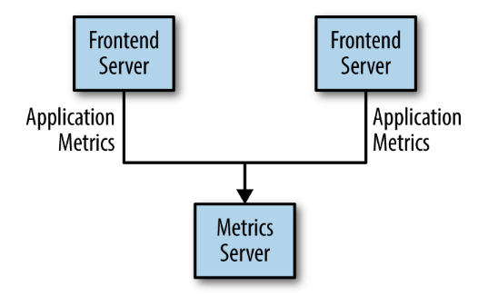
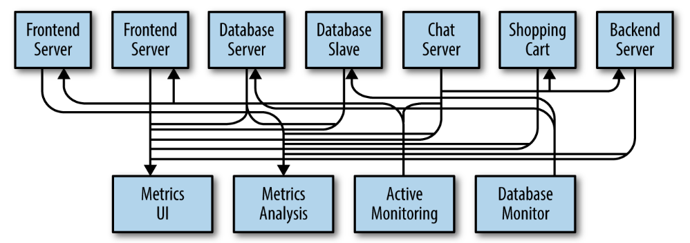
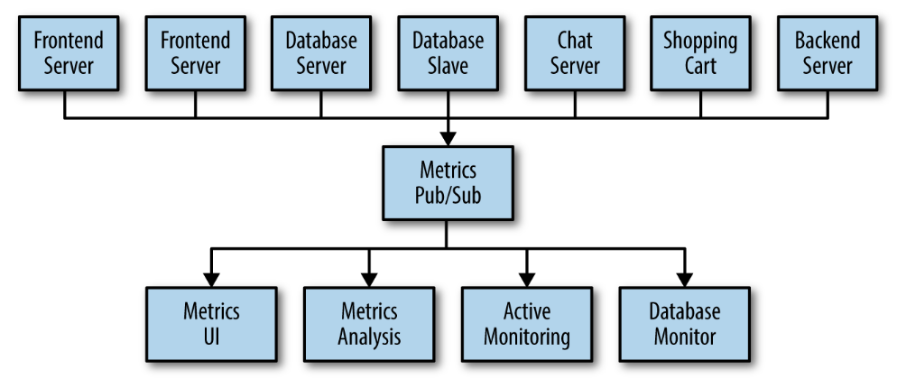
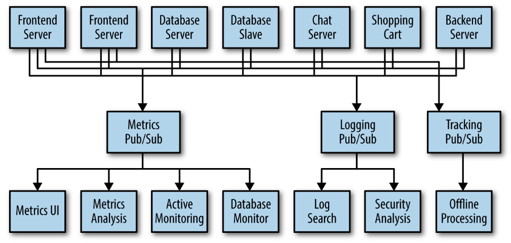
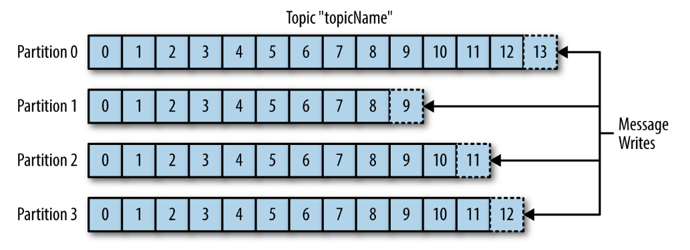
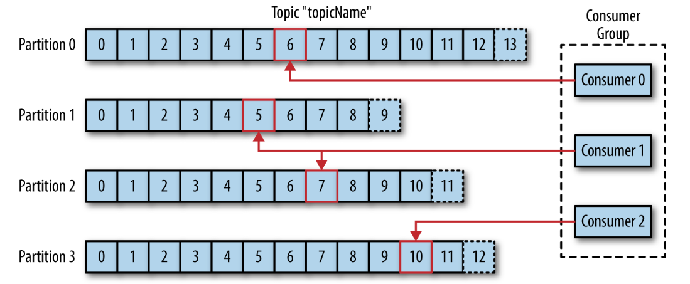
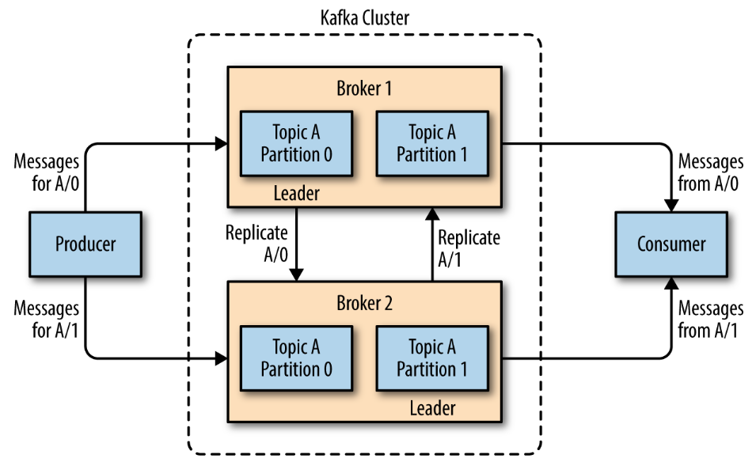

# Meet Kafka

## Publish/Subscribe Messaging
Publish/subscribe messaging is a pattern that is characterized by the sender (publisher) of a piece of data (message) 
not specifically directing it to a receiver. Instead, the publisher classifies the message somehow, 
and that receiver (subscriber) subscribes to receive certain classes of messages. 
Pub/sub systems often have a broker, a central point where messages are published, to facilitate this.

## How it starts
For example, you create an application that needs to send monitoring information somewhere and displays your 
metrics on a dashboard

 
 
 You decide you would like to analyze your metrics over
 a longer term, and that doesn’t work well in the dashboard.
 
 So you decide to resolve this issue generating a huge problem
  
  
  The technical debt built up here is obvious, so you decide to pay some of it back.
  
  
  Congratulations, you have built a publish-subscribe messaging system!
  
  ## Individual queue systems
  You also know that there will be more use cases for messaging coming soon.
  
  
  What  you would like to have is a single centralized system that allows for publishing generic
  types of data, which will grow as your business grows.
  
  ## Enter Kafka
  
  * Designed to solve this problem;
  * Often described as a distributing streaming platform;
  * Is designed to provide a durable record of all transactions;
  * The data can be distributed within the system to provide additional protections against failures;
  
  ### Messages and batches
  
  * The unit of data within Kafka is called a message (similar to row or record in databases);
  * Messages is simply an array of bytes as far as Kafka is concerned;
  * A message can have an optional bit of metadata, which is referred to as a key;
  * Keys are used when messages are to be written to partitions in a more controlled manner;
  * For efficiency, messages are written into Kafka in batches.
  
  ### Schemas
  
  * Avro is a serialization framework originally developed for Hadoop;
  * Provides a compact serialization format;
  * Schemas that are separate from the message payloads;
  * Strong data typing;
  
  A consistent data format is important in Kafka, as it allows writing and reading messages to be decoupled.
  By using well-defined schemas and storing them in a common repository, the messages in Kafka can be understood without coordination.
  
  ### Topics and partitions
  
  * Messages in Kafka are categorized into topics (like database table or a folder in a filesystem);
  * Topics are broken down into a number of partitions;
  * Note that as a topic typically has multiple partitions, there is no guarantee of message time-ordering across the entire topic, just within a single partition.
  * Partitions are also the way that Kafka provides redundancy and scalability.
  * Each partition can be hosted on a different server
  
   
   
   ### Producers and consumers
   
   **Producers:**
   * Producers create new messages;
   * The message will be produced to a specific topic;
   * The producer does not care what partition a specific message is written. In some cases, the pro 
   ducer will direct messages to specific partitions. This is typically done using the message key and 
   a partitioner that will generate a hash of the key and map it to a specific partition.
   
   **Consumers**
   * Consumers read messages;
   * The consumer subscribes to one or more topics and reads the messages in the order in which they were produced.
   * Keeps track of which messages it has already consumed by keeping track of the offset of messages.
     Offset is an integer value that continually increases that Kafka adds to each message as it is produced.
   * Consumers work as part of a consumer group. The group assures that each partition is only consumed by one member
      
   
   
   ### Brokers and Clusters
   
   ***Brokers***
   * A single Kafka server is called a broker.
   * Receives messages from producers, assigns offsets to them and commits the messages to storage on disk;
   * It also serves consumers, responding to fetch requests for partitions;
   * A single broker can easily handle thousands of partitions and millions of messages per second.
   
   ***Clusters***
   * Kafka brokers are designed to operate as part of a cluster;
   * One broker will also function as the cluster controller, responsible for adminsitrative operations, 
   including assigning partitions to brokers and monitoring for broker failures;
   * A partition is owned by a single broker called leader;
   * A partition may be assigned to multiple brokers, this provides redundancy of messages in the partition;
   
   
   
   ***Retention***
   * Is the durable storage of messages for some period of time.
   * Kafka brokers are configured with a default retention setting for topics (time or size);
   * Topics can also be configured with their own retention settings;
   
   ### Multiple clusters
   
   ***Reasons***
   * Segregation of types of data
   * Isolation for security requirements
   * Multiple datacenters (disaster recovery)
   
   When working with multiple datacenters in particular, it is often required that messages be copied between them. 
   The replication mechanisms within the Kafka clusters are designed only to work within a single
   cluster, not between multiple clusters.
   The Kafka project includes a tool called MirrorMaker
   
   ### Why Kafka?
   
   * Kafka is able to handle multiple producers, whether those clients are using many topics or the same topic;
   * Kafka is designed for multiple consumers to read any single stream of messages without interfering with each other;
   * Disk-Based Retention - retention means that if a consumer falls behind, either due to slow processing or a 
   burst in traffic, there is no danger of losing data;
   * Scalable (one or many brokers or a large cluster);
   * High Performance;
   
   ### Use cases
   * Activity tracking - The original use case for Kafka, as it was designed at LinkedIn, is that of user activity
   tracking.
   * Messaging - Used for messaging, where applications need to send notifications (such as emails) to users.
   * Metrics and logging - (Consumers - Grafana and logz);
   *Commit log - database changes can be published to Kafka and applications can easily monitor this stream 
   to receive live updates as they happen.
   *Stream processing - ETL
   
   ## Kafka's origin
   Kafka was created to address the data pipeline problem at LinkedIn.
   
   ### The Name
   Tribute for the writer Franz Kafka
   
   
   
