# Stream Processing

- Kafka was traditionally seen as a powerful message bus, capable of delivering streams of events but without processing or transformation capabilities. Kafka’s reliable stream delivery capabilities make it a perfect source of data for stream-processing systems.

- In the same way that data processing was significantly more difficult before databases were invented, stream processing was held back by lack of a stream processing platform.

- After 0.10.0 Kafka includes a pow‐ erful stream-processing library as part of its collection of client libraries.

- This allows developers to consume, process, and produce events in their own apps, without relying on an external processing framework.

## What is a data stream ?

Also called an event stream or streaming data. A data stream is an abstraction representing an unbounded dataset. Unbounded means infinite and ever growing. The dataset is unbounded because over time, new records keep arriving. This definition is used by Google, Amazon, and pretty much everyone else.

- Note that this concept can be used in pretty much every business activity we care to analyze: stream of credit card transactions, stock trades, package deliveries, network events going through a switch. **This is because pretty much everything can be seen as a sequence of events**

- **Event streams are ordered**: There is an inherent notion of which events occur before or after other events. This is clearest when looking at financial events.

  - PS: Note that this is one of the differences between an event stream and a database table—records in a table are always considered unordered

- **Immutable data records**: Events, once occured, can never be modified. A financial transaction that is can‐ celled does not disapear. Instead, an additional event is written to the stream, recording a cancellation of previous transaction.

  - PS: This is another difference between a data stream and a database table, we can delete or update records in a table

- **Event streams are replayable**: This is a desirable property. for most business applications, it is critical to be able to replay a raw stream of events that occured months (and sometimes years) earlier. This is required in order to cor‐ rect errors, try new methods of analysis, or perform audits.

- Events can be tiny (few bytes) or very big. They can also be completely unstructured, key-value pairs, semi-structured JSON, or struc‐ tured Avro or Protobuf messages.

- While it is often assumed that data streams are “big data” and involve millions of events per second, the same techniques we’ll discuss apply equally well (and often better) to smaller streams of events with only a few events per second or minute.

## What Is Stream Processing?

- Stream processing refers to the ongoing processing of one or more event streams. Stream processing is a programming paradigm just like request-response and batch processing.

### Comparing paradigms

1. **Request-response**

- This is the lowest latency paradigm, with response times ranging from submilli‐ seconds to a few milliseconds, usually with the expectation that response times will be highly consistent. The mode of processing is usually blocking—an app sends a request and waits for the processing system to respond. In the database world, this paradigm is known as online transaction processing (OLTP). Examples: Point-of-sale systems, credit card processing, and time-tracking systems typically work in this paradigm.

2. **Batch processing**

- This is the high-latency/high-throughput option. The processing system wakes up at set times—every day at 2:00 A.M., every hour on the hour, etc. It reads all required input (either all data available since last execution, all data from begin‐ ning of month, etc.), writes all required output, and goes away until the next time it is scheduled to run.

- In the database world, these are the data warehouse and business intelligence systems—data is loaded in huge batches once a day, reports are generated, and users look at the same reports until the next data load occurs.

- This paradigm often has great efficiency and economy of scale, but in recent years, businesses need the data available in shorter timeframes in order to make decision-making more timely and efficient. This puts huge pressure on systems that were written to exploit economy of scale — not to provide low-latency reporting.

3. **Stream processing**

- This is a contentious and nonblocking option. Filling the gap between the request-response world where we wait for events that take two milliseconds to process and the batch processing world where data is processed once a day and takes eight hours to complete.

- Most business processes don’t require an immedi‐ ate response within milliseconds but can’t wait for the next day either. Most busi‐ ness processes happen continuously, and as long as the business reports are updated continuously and the line of business apps can continuously respond, the processing can proceed without anyone waiting for a specific response within milliseconds.

- Business processes like alerting on suspicious credit transactions or network activity, adjusting prices in real-time based on supply and demand, or tracking deliveries of packages are all natural fit for continuous but nonblocking processing.

NOTE: It is important to note that the definition doesn’t mandate any specific framework, API, or feature. As long as you are continuously reading data from an unbounded dataset, doing something to it, and emitting output, you are doing stream processing.

## Stream-processing Concepts

- Stream processing is very similar to any type of data processing—you write code that receives data, does something with the data—a few transformations, aggregates, enrichments, etc.—and then place the result somewhere.

- Unique concepts to sream processing will be specified bellow:

### Time

- Time is probably the most important concept in stream processing and often the most confusing. In the context of stream processing, having a common notion of time is critical because most stream applications perform operations on time windows.
- Example: our stream application might calculate a moving five-minute average of stock prices. In that case, we need to know what to do when one of our producers goes offline for two hours due to network issues and returns with two hours worth of data—most of the data will be relevant for five-minute time windows that have long passed and for which the result was already calculated and stored.

- Stream-processing systems typically refer to the following notions of time:

1. **Event time**

- This is the time the events we are tracking occurred and the record was created
- Ex: the time a measurement was taken, an item at was sold at a shop, a user viewed a page on our website, etc.
- Kafka 0.10.0: automatically adds the current time to producer records at the time they are created.
- Event time is usually the time that matters most when processing stream data.

2. **Log append time**

- This is the time the event arrived to the Kafka broker and was stored there.
- Kafka 0.10.0 or higher, brokers will automatically add this time to records they receive if Kafka is configured to do so or if the records arrive from older producers and contain no timestamps.
- This notion of time is typically less relevant for stream processing, since we are usually interested in the times the events occurred.
- Ex: if we calculate number of devices produced per day, we want to count devices that were actually produced on that day, even if there were network issues and the event only arrived to Kafka the following day.

3. **Processing time**

- This is the time at which a stream-processing application received the event in order to perform some calculation.
- This notion of time assigns different timestamps to the same event depending on exactly when each stream processing application hap‐ pened to read the event.
- it can even differ for two threads in the same applica‐ tion! Therefore, this notion of time is highly unreliable and best avoided.

NOTE: When working with time, it is important to be mindful of time zones. The entire data pipeline should standardize on a single time zones; otherwise, results of stream operations will be confusing and often meaningless. If you must handle data streams with different time zones, you need to make sure you can convert events to a sin‐ gle time zone before performing operations on time windows. Often this means storing the time zone in the record itself.

### State

- As long as you only need to process each event individually, stream processing is a very simple activity.

- Stream processing becomes really interesting when you have operations that involve multiple events

  - Ex: counting the number of events by type, moving averages, joining two streams to create an enriched stream of information, etc.

- In those cases, it is not enough to look at each event by itself; you need to keep track of more information— how many events of each type did we see this hour, all events that require joining, sums, averages, etc. We call the information that is stored between events a **state**.

1. **Local or internal state**

- State that is accessible only by a specific instance of the stream-processing application. This state is usually maintained and managed with an embedded, in-memory database running within the application.
  - Extremely fast, limited by the amount of memory available

2. **External state**

- State that is maintained in an external datastore, often a NoSQL system like Cas‐ sandra. The advantages of an external state are its virtually unlimited size and the fact that it can be accessed from multiple instances of the application or even from different applications. The downside is the extra latency and complexity introduced with an additional system.

### Stream-Table Duality

- We are all familiar with database tables. A table is a collection of records, each identi‐ fied by its primary key and containing a set of attributes as defined by a schema. Table records are mutable (i.e., tables allow update and delete operations)

- Unlike tables, streams contain a history of changes. Streams are a string of events wherein each event caused a change. A table contains a current state of the world, which is the result of many changes. From this description, it is clear that streams and tables are two sides of the same coin—the world always changes, and sometimes we are interested in the events that caused those changes, whereas other times we are interested in the current state of the world. Systems that allow you to transition back and forth between the two ways of looking at data are more powerful than systems that support just one.

- In order to convert a table to a stream, we need to capture the changes that modify the table. Take all those insert, update, and delete events and store them in a stream. Most databases offer change data capture (CDC) solutions for capturing these changes and there are many Kafka connectors that can pipe those changes into Kafka where they will be available for stream processing.

- In order to convert a stream to a table, we need to apply all the changes that the stream contains. This is also called materializing the stream. We create a table, either in memory, in an internal state store, or in an external database, and start going over all the events in the stream from beginning to end, changing the state as we go. When we finish, we have a table representing a state at a specific time that we can use.

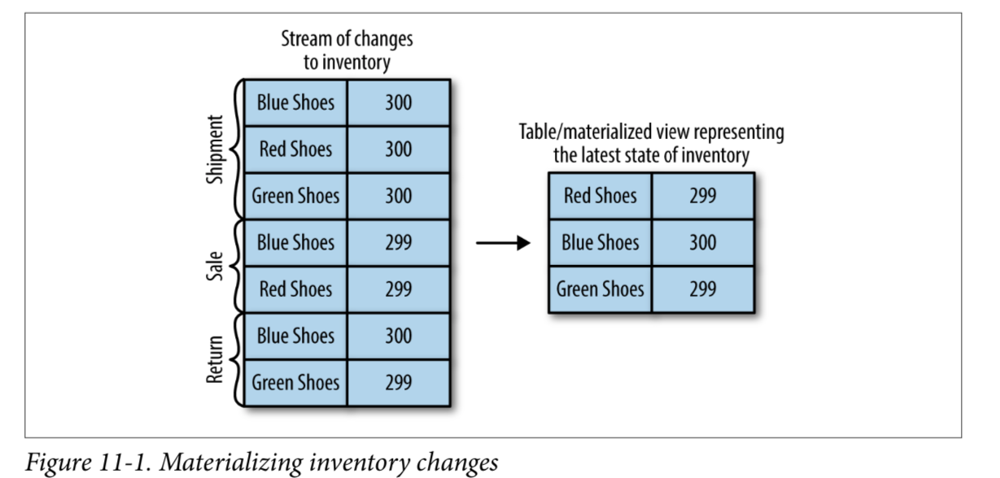

### Time Windows

- Most operations on streams are windowed operations—operating on slices of time. Examples: moving averages, top products sold this week, 99th percentile load on the system, etc.

- Join operations on two streams are also windowed we join events that occurred at the same slice of time.

- Windows can be aligned to clock time — i.e., a five-minute window that moves every minute will have the first slice as 00:00-00:05 and the second as 00:01-00:06. Or it can be unaligned and simply start whenever the app started and then the first slice can be 03:17-03:22. Sliding windows are never aligned because they move whenever there is a new record. See Figure 11-2 for the difference between two types of these windows.

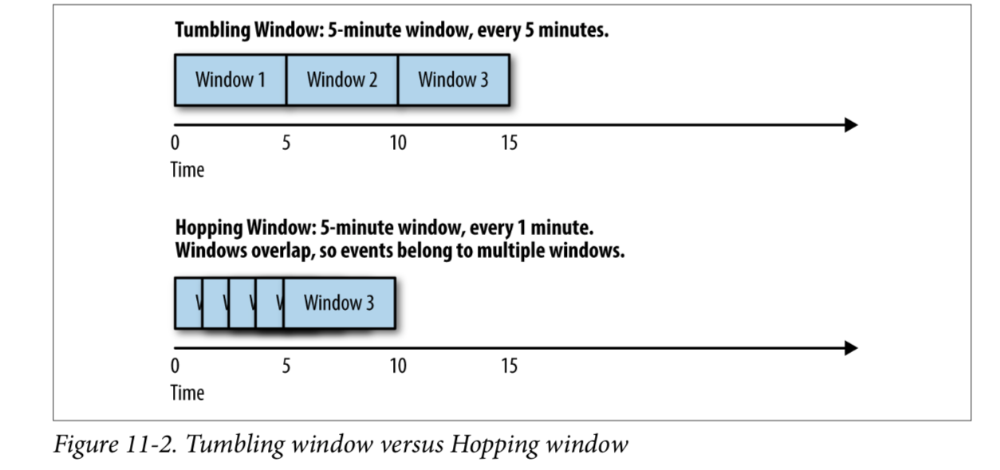

## Stream-Processing Design Patterns

- Every stream-processing system is different—from the basic combination of a con‐ sumer, processing logic, and producer to involved clusters like Spark Streaming with its machine learning libraries, and much in between. But there are some basic design patterns, which are known solutions to common requirements of stream-processing architectures. We’ll review a few of those well-known patterns and show how they are used with a few examples.

### Single-Event Processing

- The most basic pattern of stream processing is the processing of each event in isola‐ tion. This is also known as a map/filter pattern because it is commonly used to filter unnecessary events from the stream or transform each event.

- In this pattern, the stream-processing app consumes events from the stream, modifies each event, and then produces the events to another stream. An example is an app that reads log messages from a stream and writes ERROR events into a high-priority stream and the rest of the events into a low-priority stream. Another example is an application that reads events from a stream and modifies them from JSON to Avro. Such applications need to maintain state within the application because each event can be handled independently. This means that recovering from app failures or load- balancing is incredibly easy as there is no need to recover state; you can simply hand off the events to another instance of the app to process.

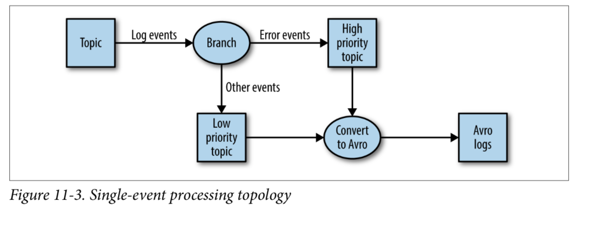

### Processing with Local State

- Most stream-processing applications are concerned with aggregating information, especially time-window aggregation.

  - Example: maximum stock prices for day

- These aggregations require maintaining a state for the stream. In our example, in order to calculate the minimum and average price each day, we need to store the minimum and maximum values we've seen up until the current time and compare each new value in the stream to the stored minimum and maximum.

- All these can be done using local state (rather than a shared state) because each opera‐ tion in our example is a group by aggregate. That is, we perform the aggregation per stock symbol, not on the entire stock market in general. We use a Kafka partitioner to make sure that all events with the same stock symbol are written to the same parti‐ tion. Then, each instance of the application will get all the events from the partitions that are assigned to it (this is a Kafka consumer guarantee). This means that each instance of the application can maintain state for the subset of stock symbols that are written to the partitions that are assigned to it

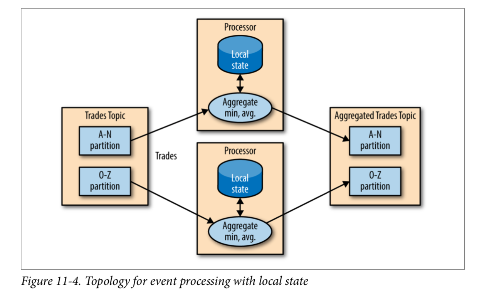

- Stream-processing applications become significantly more complicated when the application has local state and there are several issues a stream-processing application must address:

1. **Memory usage**

The local state must fit into the memory available to the application instance.

2. **Persistence**

We need to make sure the state is not lost when an application instance shuts down, and that the state can be recovered when the instance starts again or is replaced by a different instance.

This is something that Kafka Streams handles very well—local state is stored in-memory using embedded RocksDB, which also persists the data to disk for quick recovery after restarts. But all the changes to the local state are also sent to a Kafka topic. If a stream’s node goes down, the local state is not lost—it can be easily recreated by rereading the events from the Kafka topic. For example, if the local state contains “current minimum for IBM=167.19,” we store this in Kafka, so that later we can repopulate the local cache from this data. Kafka uses log compaction for these topics to make sure they don’t grow endlessly and that recreating the state is always feasible.

3. **Rebalancing**

Partitions sometimes get reassigned to a different consumer. When this happens, the instance that loses the partition must store the last good state, and the instance that receives the partition must know to recover the correct state.

### Multiphase Processing/Repartitioning

- Local state is great if you need a group by type of aggregate. But what if you need a result that uses all available information?

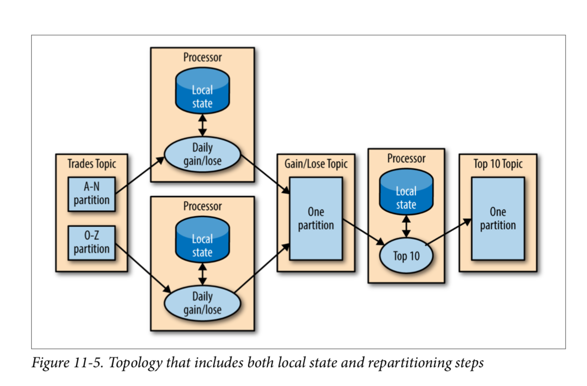

### Processing with External Lookup: Stream-Table Join

Sometimes stream processing requires integration with data external to the stream— validating transactions against a set of rules stored in a database, or enriching click‐ stream information with data about the users who clicked.

Ex: The obvious idea on how to perform an external lookup for data enrichment is some‐ thing like this: for every click event in the stream, look up the user in the profile data‐ base and write an event that includes the original click plus the user age and gender to another topic

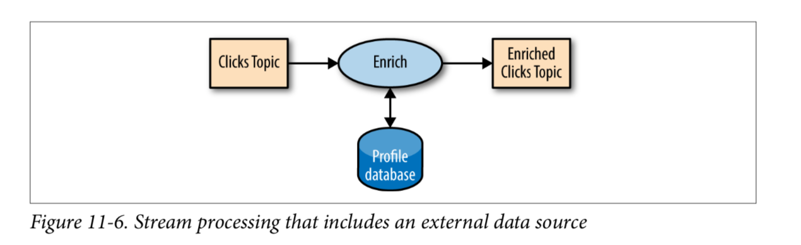

The problem with this obvious idea is that an external lookup adds significant latency to the processing of every record—usually between 5-15 milliseconds. In many cases, this is not feasible. Also often the external datasource cannot handle the load.

But if we can capture all the changes that happen to the database table in a stream of events, we can have our stream-processing job listen to this stream and update the cache based on database change events. Capturing changes to the database as events in a stream is known as CDC, and if you use Kafka Connect you will find multiple connectors capable of performing CDC and converting database tables to a stream of change events. This allows you to keep your own private copy of the table, and you will be notified whenever there is a database change event so you can update your own copy accordingly

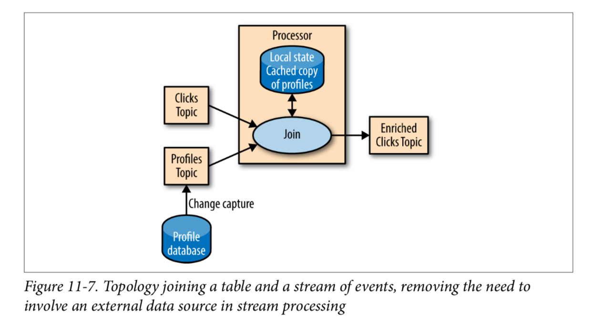

Then, when you get click events, you can look up the user_id at your local cache and enrich the event. And because you are using a local cache, this scales a lot better and will not affect the database and other apps using it.

### Streaming Join

- Sometimes you want to join two real event streams rather than a stream with a table.

- When you use a stream to represent a table, you can ignore most of the history in the stream because you only care about the current state in the table. But when you join two streams, you are joining the entire history, trying to match events in one stream with events in the other stream that have the same key and happened in the same time-windows. This is why a streaming-join is also called a **windowed-join**.

- EX: For example, let’s say that we have one stream with search queries that people entered into our website and another stream with clicks, which include clicks on search results. We want to match search queries with the results they clicked on so that we will know which result is most popular for which query. Obviously we want to match results based on the search term but only match them within a certain time-window.

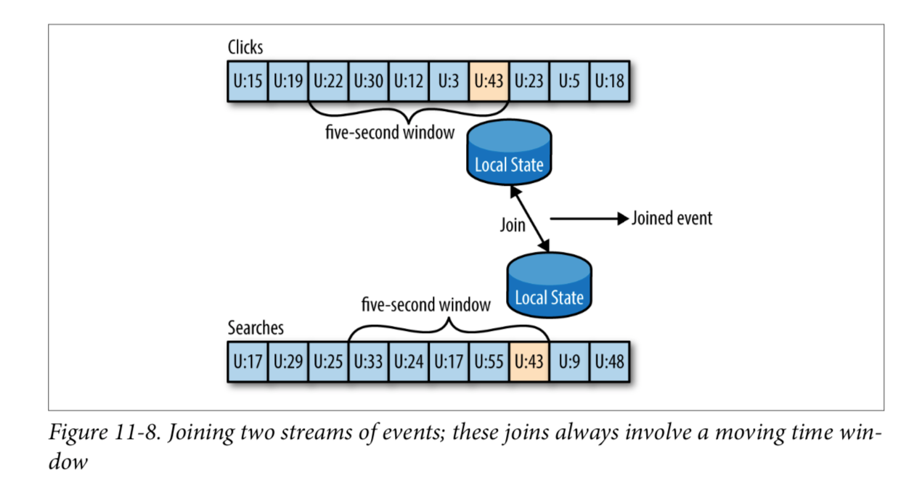

- The way this works in Kafka Streams is that both streams, queries and clicks, are par‐ titioned on the same keys, which are also the join keys. This way, all the click events from user_id:42 end up in partition 5 of the clicks topic, and all the search events for user_id:42 end up in partition 5 of the search topic. Kafka Streams then makes sure that partition 5 of both topics is assigned to the same task. So this task sees all the relevant events for user_id:42. It maintains the join-window for both topics in its embedded RocksDB cache, and this is how it can perform the join.

### Out-of-Sequence Events

- Handling events that arrive at the stream at the wrong time is a challenge not just in stream processing but also in traditional ETL systems.

- Ex: For example, a mobile device loses WiFi signal for a few hours and sends a few hours’ worth of events when it reconnects. This also happens when moni‐ toring network equipment (a faulty switch doesn’t send diagnostics signals until it is repaired) or manufacturing (network connectivity in plants is notoriously unreliable, especially in developing countries).

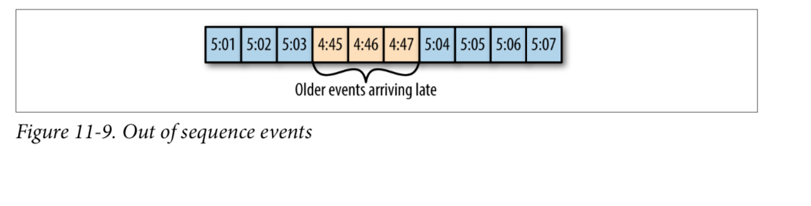

- Our streams applications need to be able to handle those scenarios. This typically means the application has to do the following:

  1. Recognize that an event is out of sequence—this requires that the application examine the event time and discover that it is older than the current time.
  2. Define a time period during which it will attempt to reconcile out-of-sequence events. Perhaps a three-hour delay should be reconciled and events over three weeks old can be thrown away.
  3. Have an in-band capability to reconcile this event. This is the main difference between streaming apps and batch jobs. If we have a daily batch job and a few events arrived after the job completed, we can usually just rerun yesterday’s job and update the events. With stream processing, there is no “rerun yesterday’s job” —the same continuous process needs to handle both old and new events at any given moment.
  4. Be able to update results. If the results of the stream processing are written into a database, a put or update is enough to update the results. If the stream app sends results by email, updates may be trickier.

- Several stream-processing frameworks, including Google’s Dataflow and Kafka Streams, have built-in support for the notion of event time independent of the pro‐ cessing time and the ability to handle events with event times that are older or newer than the current processing time. This is typically done by maintaining multiple aggregation windows available for update in the local state and giving developers the ability to configure how long to keep those window aggregates available for updates. Of course, the longer the aggregation windows are kept available for updates, the more memory is required to maintain the local state.

- The Kafka’s Streams API always writes aggregation results to result topics. Those are usually compacted topics, which means that only the latest value for each key is pre‐ served. In case the results of an aggregation window need to be updated as a result of a late event, Kafka Streams will simply write a new result for this aggregation window, which will overwrite the previous result.

### Reprocessing

- The last important pattern is processing events. There are two variants of this pattern:

1.  We have an improved version of our stream-processing application. We want to run the new version of the application on the same event stream as the old, pro‐ duce a new stream of results that does not replace the first version, compare the results between the two versions, and at some point move clients to use the new results instead of the existing ones.
2.  The existing stream-processing app is buggy. We fix the bug and we want to reprocess the event stream and recalculate our results

- The first use case is made simple by the fact that Apache Kafka stores the event streams in their entirety for long periods of time in a scalable datastore. This means that having two versions of a stream processing-application writing two result streams only requires the following:

1.  Spinning up the new version of the application as a new consumer group
2.  Configuring the new version to start processing from the first offset of the input topics (so it will get its own copy of all events in the input streams)
3.  Letting the new application continue processing and switching the client applica‐ tions to the new result stream when the new version of the processing job has caught up

- The second use case is more challenging—it requires “resetting” an existing app to start processing back at the beginning of the input streams, resetting the local state (so we won’t mix results from the two versions of the app), and possibly cleaning the previous output stream. While Kafka Streams has a tool for resetting the state for a stream-processing app, our recommendation is to try to use the first method when‐ ever sufficient capacity exists to run two copies of the app and generate two result streams. The first method is much safer—it allows switching back and forth between multiple versions and comparing results between versions, and doesn’t risk losing critical data or introducing errors during the cleanup process.

## Kafka Streams by Example

PS: It is important to remember that the patterns can be imple‐ mented in any stream-processing framework and library—the patterns are universal but the examples are specific.

- Apache Kafka has two streams APIs — a low-level Processor API and a high-level Streams DSL.

  - The DSL allows you to define the stream-processing application by defining a chain of transformations to events in the streams. Transformations can be as simple as a filter or as complex as a stream-to-stream join.
  - The lower level API allows you to create your own transfor‐ mations, but as you’ll see, this is rarely required.

- An application that uses the DSL API always starts with using the StreamBuilder to create a processing topology—a directed graph (DAG) of transformations that are applied to the events in the streams. Then you create a KafkaStreams execution object from the topology. Starting the KafkaStreams object will start multiple threads, each applying the processing topology to events in the stream. The processing will conclude when you close the KafkaStreams object.

### Word count (Map-Filter)

Code: https://github.com/gwenshap/kafka-streams-wordcount

- Comments:

1. Every Kafka Streams application must have an application ID. This is used to coordinate the instances of the application and also when naming the internal local stores and the topics related to them. This name must be unique for each Kafka Streams application working with the same Kafka cluster.

2. The Kafka Streams application always reads data from Kafka topics and writes its output to Kafka topics. As we’ll discuss later, Kafka Streams applications also use Kafka for coordination. So we had better tell our app where to find Kafka.

- When reading and writing data, our app will need to serialize and deserialize, so we provide default Serde classes. If needed, we can override these defaults later when building the streams topology.

In just a few short lines, we demonstrated how easy it is to implement a sin‐ gle event processing pattern (we applied a map and a filter on the events). We reparti‐ tioned the data by adding a group-by operator and then maintained simple local state when we counted the number of records that have each word as a key. Then we main‐ tained simple local state when we counted the number of times each word appeared.

### Stock Market Statistics (Stream windowed aggregation)

Code: https://github.com/gwenshap/kafka-streams-stockstats

- Same steup as Word Count. However the main difference is the Serde class: before we used string -> string and now string -> trade

- You need to remember to provide a Serde object for every object you want to store in Kafka—input, output, and in some cases, also intermediate results. To make this easier, we recommend generating these Serdes through projects like GSon, Avro, Protobufs, or similar.

Comments:

- We start by reading events from the input topic and performing a groupByKey() operation. Despite its name, this operation does not do any grouping. Rather, it ensures that the stream of events is partitioned based on the record key. Since we wrote the data into a topic with a key and didn’t modify the key before calling groupByKey(), the data is still partitioned by its key—so this method does noth‐ ing in this case.

- "trade-stats-store" is the name of the local state store

- The results of the aggregation is a table with the ticker and the time window as the primary key and the aggregation result as the value. We are turning the table back into a stream of events and replacing the key that contains the entire time window definition with our own key that contains just the ticker and the start time of the window. This toStream method converts the table into a stream and also converts the key into my TickerWindow object.

- The last step is to update the average price—right now the aggregation results include the sum of prices and number of trades. We go over these records and use the existing statistics to calculate average price so we can include it in the out‐ put stream.

- This example shows how to perform windowed aggregation on a stream—probably the most popular use case of stream processing. One thing to notice is how little work was needed to maintain the local state of the aggregation—just provide a Serde and name the state store. Yet this application will scale to multiple instances and automat‐ ically recover from a failure of each instance by shifting processing of some partitions to one of the surviving instances.

### Click Stream Enrichment (Stream joins)

Code: https://github.com/gwenshap/kafka-clickstream-enrich/tree/master

- The last example will demonstrate streaming joins by enriching a stream of clicks on a website. We will generate a stream of simulated clicks, a stream of updates to a fic‐ tional profile database table, and a stream of web searches.

- Same basic configuration as before. What will change is after the instance of kafka builder

1.  First, we create a streams objects for the two streams we want to join—clicks and searches.
2.  We also define a KTable for the user profiles. A KTable is a local cache that is updated through a stream of changes.
3.  Then we enrich the stream of clicks with user-profile information by joining the stream of events with the profile table. In a stream-table join, each event in the stream receives information from the cached copy of the profile table. We are doing a left-join, so clicks without a known user will be preserved.
4.  This is the join method—it takes two values, one from the stream and one from the record, and returns a third value. Unlike in databases, you get to decide how to combine the two values into one result. In this case, we created one activity object that contains both the user details and the page viewed.
5.  Next, we want to join the click information with searches performed by the same user. This is still a left join, but now we are joining two streams, not streaming to a table.
6.  This is the join method—we simply add the search terms to all the matching page views.
7.  This is the interesting part—a stream-to-stream join is a join with a time window. Joining all clicks and searches for each user doesn’t make much sense—we want to join each search with clicks that are related to it—that is, click that occurred a short period of time after the search. So we define a join window of one second. Clicks that happen within one second of the search are considered relevant, and the search terms will be included in the activity record that contains the click and the user profile. This will allow a full analysis of searches and their results.

- This example shows two different join patterns possible in stream processing. One joins a stream with a table to enrich all streaming events with information in the table. This is similar to joining a fact table with a dimension when running queries on a data warehouse. The second example joins two streams based on a time window. This operation is unique to stream processing.

## Kafka Streams: Architecture Overview

The examples in the previous section demonstrated how to use the Kafka Streams API to implement a few well-known stream-processing design patterns. But to understand better how Kafka’s Streams library actually works and scales, we need to peek under the covers and understand some of the design principles behind the API.

### Building a Topology

Every streams application implements and executes at least one topology. Topology (also called DAG, or directed acyclic graph, in other stream-processing frameworks) is a set of operations and transitions that every event moves through from input to output.

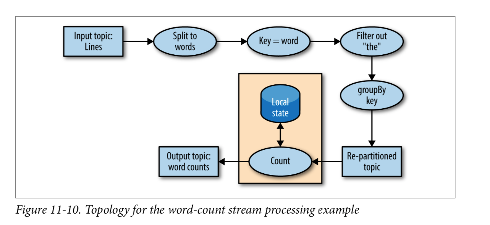

- Even a simple app has a nontrivial topology. The topology is made up of processors— those are the nodes in the topology graph (represented by circles in our diagram). Most processors implement an operation of the data—filter, map, aggregate, etc. There are also source processors, which consume data from a topic and pass it on, and sink processors, which take data from earlier processors and produce it to a topic. A topology always starts with one or more source processors and finishes with one or more sink processors.

### Scaling the Topology

Kafka Streams scales by allowing multiple threads of executions within one instance of the application and by supporting load balancing between distributed instances of the application. You can run the Streams application on one machine with multiple threads or on multiple machines; in either case, all active threads in the application will balance the work involved in data processing.

The Streams engine parallelizes execution of a topology by splitting it into tasks. The number of tasks is determined by the Streams engine and depends on the number of partitions in the topics that the application processes. Each task is responsible for a subset of the partitions: the task will subscribe to those partitions and consume events from them. For every event it consumes, the task will execute all the processing steps that apply to this partition in order before eventually writing the result to the sink. Those tasks are the basic unit of parallelism in Kafka Streams, because each task can execute independently of others.

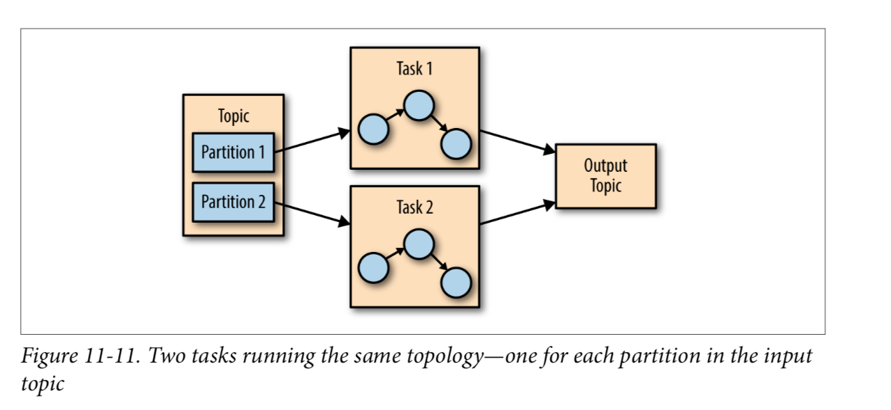

The developer of the application can choose the number of threads each application instance will execute. If multiple threads are available, every thread will execute a subset of the tasks that the application creates. If multiple instances of the application are running on multiple servers, different tasks will execute for each thread on each server. This is the way streaming applications scale: you will have as many tasks as you have partitions in the topics you are processing. If you want to process faster, add more threads. If you run out of resources on the server, start another instance of the application on another server. Kafka will automatically coordinate work—it will assign each task its own subset of partitions and each task will independently process events from those partitions and maintain its own local state with relevant aggregates if the topology requires this.

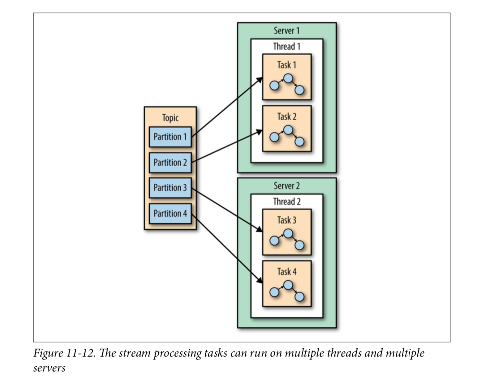

How Kafka Streams handle dependent tasks ? Kafka Streams handles this situation by assigning all the partitions needed for one join to the same task so that the task can consume from all the relevant partitions and perform the join independently. This is why Kafka Streams currently requires that all topics that participate in a join operation will have the same number of parti‐ tions and be partitioned based on the join key.

- Another example of dependencies between tasks is when our application requires repartitioning. For instance, in the ClickStream example, all our events are keyed by the user ID. But what if we want to generate statistics per page? Or per zip code? We’ll need to repartition the data by the zip code and run an aggregation of the data with the new partitions. If task 1 processes the data from partition 1 and reaches a pro‐ cessor that repartitions the data (groupBy operation), it will need to shuffle, which means sending them the events—send events to other tasks to process them. Unlike other stream processor frameworks, Kafka Streams repartitions by writing the events to a new topic with new keys and partitions. Then another set of tasks reads events from the new topic and continues processing. The repartitioning steps break our top‐ ology into two subtopologies, each with its own tasks. The second set of tasks depends on the first, because it processes the results of the first subtopology. How‐ ever, the first and second sets of tasks can still run independently and in parallel because the first set of tasks writes data into a topic at its own rate and the second set consumes from the topic and processes the events on its own. There is no communi‐ cation and no shared resources between the tasks and they don’t need to run on the same threads or servers. This is one of the more useful things Kafka does—reduce dependencies between different parts of a pipeline

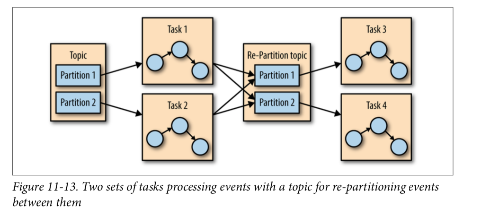

### Surviving Failures

- The same model that allows us to scale our application also allows us to gracefully handle failures. First, Kafka is highly available, and therefore the data we persist to Kafka is also highly available. So if the application fails and needs to restart, it can look up its last position in the stream from Kafka and continue its processing from the last offset it committed before failing. Note that if the local state store is lost (e.g., because we needed to replace the server it was stored on), the streams application can always re-create it from the change log it stores in Kafka.

- Kafka Streams also leverages Kafka’s consumer coordination to provide high availa‐ bility for tasks. If a task failed but there are threads or other instances of the streams application that are active, the task will restart on one of the available threads. This is similar to how consumer groups handle the failure of one of the consumers in the group by assigning partitions to one of the remaining consumers.

## Stream Processing Use Cases

Stream processing—or continuous processing—is useful in cases where you want your events to be processed in quick order rather than wait for hours until the next batch, but also where you are not expecting a response to arrive in milliseconds. This is all true but also very abstract. Let’s look at a few real scenarios that can be solved with stream processing:

1. **Customer Service**

Suppose that you just reserved a room at a large hotel chain and you expect an email confirmation and receipt. A few minutes after reserving, when the confir‐ mation still hasn’t arrived, you call customer service to confirm your reservation. Suppose the customer service desk tells you “I don’t see the order in our system, but the batch job that loads the data from the reservation system to the hotels and the customer service desk only runs once a day, so please call back tomorrow. You should see the email within 2-3 business days.” This doesn’t sound like very good service, yet I’ve had this conversation more than once with a large hotel chain. What we really want is every system in the hotel chain to get an update about a new reservations seconds or minutes after the reservation is made, including the customer service center, the hotel, the system that sends email con‐ firmations, the website, etc. You also want the customer service center to be able to immediately pull up all the details about any of your past visits to any of the hotels in the chain, and the reception desk at the hotel to know that you are a loyal customer so they can give you an upgrade. Building all those systems using stream-processing applications allows them to receive and process updates in near real time, which makes for a better customer experience. With such a sys‐ tem, I’d receive a confirmation email within minutes, my credit card would be charged on time, the receipt would be sent, and the service desk could immedi‐ ately answer my questions regarding the reservation.

2. **Internet of Things **

Internet of Things can mean many things—from a home device for adjusting temperature and ordering refills of laundry detergent to real-time quality control of pharmaceutical manufacturing. A very common use case when applying stream processing to sensors and devices is to try to predict when preventive maintenance is needed. This is similar to application monitoring but applied to hardware and is common in many industries, including manufacturing, telecom‐ munications (identifying faulty cellphone towers), cable TV (identifying faulty box-top devices before users complain), and many more. Every case has its own pattern, but the goal is similar: process events arriving from devices at a large scale and identify patterns that signal that a device requires maintenance. These patterns can be dropped packets for a switch, more force required to tighten screws in manufacturing, or users restarting the box more frequently for cable TV.

3. **Fraud Detection**

- Also known as anomaly detection, is a very wide field that focuses on catching “cheaters” or bad actors in the system. Examples of fraud-detection applications include detecting credit card fraud, stock trad‐ ing fraud, video-game cheaters, and cybersecurity risks. In all these fields, there are large benefits to catching fraud as early as possible, so a near real- time system that is capable of responding to events quickly—perhaps stop‐ ping a bad transaction before it is even approved—is much preferred to a batch job that detects fraud three days after the fact when cleanup is much more complicated. This is again a problem of identifying patterns in a large- scale stream of events.

## How to Choose a Stream-Processing Framework

When choosing a stream-processing framework, it is important to consider the type of application you are planning on writing. Different types of applications call for different stream-processing solutions:

1. **Ingest**

Where the goal is to get data from one system to another, with some modifica‐ tion to the data on how it will make it conform to the target system.

If you are trying to solve an ingest problem, you should reconsider whether you want a stream processing system or a simpler ingest-focused system like Kafka Connect. If you are sure you want a stream processing system, you need to make sure it has both a good selection of connectors and high-quality connectors for the systems you are targeting.

2. **Low milliseconds actions**

Any application that requires almost immediate response. Some fraud detection use cases fall within this bucket.

if you are trying to solve a problem that requires low milliseconds actions, you should also reconsider your choice of streams. Request-response patterns are often better suited to this task. If you are sure you want a stream-processing sys‐ tem, then you need to opt for one that supports an event-by-event low-latency model rather than one that focuses on microbatches.

3. **Asynchronous microservices**

These microservices perform a simple action on behalf of a larger business pro‐ cess, such as updating the inventory of a store. These applications may need to maintain a local state caching events as a way to improve performance.

if you are building asynchronous microservices, you need a stream processing system that integrates well with your message bus of choice (Kafka, hopefully), has change capture capabilities that easily deliver upstream changes to the micro‐ service local caches, and has the good support of a local store that can serve as a cache or materialized view of the microservice data.

4. **Near real-time data analytics**

These streaming applications perform complex aggregations and joins in order to slice and dice the data and generate interesting business-relevant insights.

If you are building a complex analytics engine, you also need a stream-processing system with great support for a local store—this time, not for maintenance of local caches and materialized views but rather to support advanced aggregations, windows, and joins that are otherwise difficult to implement. The APIs should include support for custom aggregations, window operations, and multiple join types.

- Other considerations

  - **Operability of the system**: Is it easy to deploy to production? Is it easy to monitor and troubleshoot? Is it easy to scale up and down when needed? Does it integrate well with your existing infrastructure? What if there is a mistake and you need to reprocess data?
  - **Usability of APIs and ease of debugging**: I’ve seen orders of magnitude differences in the time it takes to write a high- quality application among different versions of the same framework. Develop‐ ment time and time-to-market is important so you need to choose a system that makes you efficient.
  - **Makes hard things easy**: Almost every system will claim they can do advanced windowed aggregations and maintain local caches, but the question is: do they make it easy for you? Do they handle gritty details around scale and recovery, or do they supply leaky abstractions and make you handle most of the mess? The more a system exposes clean APIs and abstractions and handles the gritty details on its own, the more productive developers will be.
  - **Community**: Most stream processing applications you consider are going to be open source, and there’s no replacement for a vibrant and active community. Good commu‐ nity means you get new and exciting features on a regular basis, the quality is rel‐ atively good (no one wants to work on bad software), bugs get fixed quickly, and user questions get answers in timely manner. It also means that if you get a strange error and Google it, you will find information about it because other peo‐ ple are using this system and seeing the same issues.

## Summary

We started the chapter by explaining stream processing. We gave a formal definition and discussed the common attributes of the stream-processing paradigm. We also compared it to other programming paradigms.

We then discussed important stream-processing concepts. Those concepts were demonstrated with three example applications written with Kafka Streams.

After going over all the details of these example applications, we gave an overview of the Kafka Streams architecture and explained how it works under the covers. We conclude the chapter, and the book, with several examples of stream-processing use cases and advice on how to compare different stream-processing frameworks.
