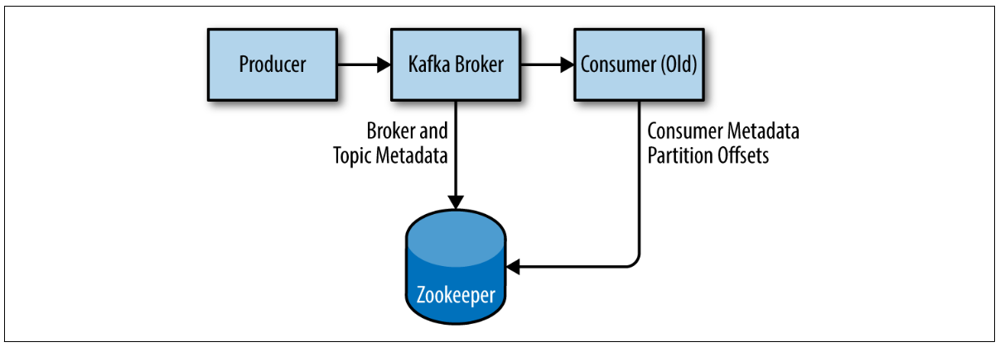
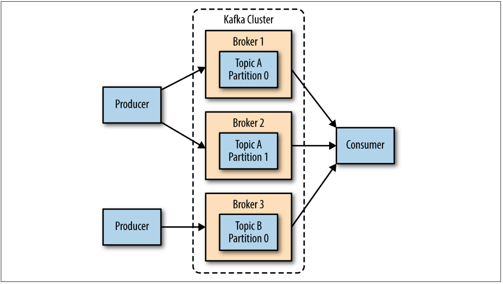

# Installing Kafka

This chapter describes how to get started with the Apache Kafka broker, including how to set up Apache Zookeeper, which is used by Kafka for storing metadata for the brokers.


## Installing Zookeeper

Apache Kafka uses Zookeeper to store metadata about the Kafka cluster, as well as consumer client details

```
> curl http://ftp.unicamp.br/pub/apache/zookeeper/zookeeper-3.6.1/apache-zookeeper-3.6.1-bin.tar.gz -o zookeper.tar.gz
> tar -xzf zookeeper.tar.gz
> mv apache-zookeeper-3.6.1-bin /usr/local/zookeeper
> mkdir -p /var/lib/zookeeper
> echo "tickTime=2000                          
dataDir=/var/lib/zookeeper
clientPort=2181" > /usr/local/zookeeper/conf/zoo.cfg
> /usr/local/zookeeper/bin/zkServer.sh start
```

### Zookeeper ensemble

A Zookeeper cluster is called an ensemble. Due to the algorithm used, it is recommended that ensembles contain an odd number of servers (e.g., 3, 5, etc.) as a majority of ensemble members (a quorum) must be working in order for Zookeeper to respond to requests. This means that in a three-node ensemble, you can run with one node missing. With a five-node ensemble, you can run with two nodes missing.




To configure Zookeeper servers in an ensemble, they must have a common configuration that lists all servers, and each server needs a myid file in the data directory that specifies the ID number of the server.

```
tickTime=2000
dataDir=/var/lib/zookeeper
clientPort=2181
initLimit=20
syncLimit=5
server.1=zoo1.example.com:2888:3888
server.2=zoo2.example.com:2888:3888
server.3=zoo3.example.com:2888:3888
```

* initLimit: The amount of time to allow followers to connect with a leader.
* syncLimit: value limits how out-of-sync followers can be with the leader. 
* tickTime: units which makes the initLimit 20 * 2000 ms, or 40 seconds. 

The configuration also lists each server in the ensemble. The servers are specified in the format server.X=hostname:peerPort:leaderPort.


## Installing a Kafka Broker

```
> curl http://ftp.unicamp.br/pub/apache/kafka/2.5.0/kafka_2.12-2.5.0.tgz -o kafka.tgz
> tar -zxf kafka.tgz
> mv kafka_2.12-2.5.0 /usr/local/kafka
> mkdir /tmp/kafka-logs
> /usr/local/kafka/bin/kafka-server-start.sh -daemon /usr/local/kafka/config/server.properties
```

## Broker Configuration
The example configuration provided with the Kafka distribution is sufficient to run a standalone server as a proof of concept, but it will not be sufficient for most installations. There are numerous configuration options for Kafka that control all aspects of setup and tuning.

### General Broker

There are several broker configurations that should be reviewed when deploying Kafka for any environment other than a standalone broker on a single server.

**broker.id:** Every Kafka broker must have an integer identifier, which is set using the broker.id configuration. By default, this integer is set to 0 , but it can be any value. The most important thing is that the integer must be unique within a single Kafka cluster;

**port:** The example configuration file starts Kafka with a listener on TCP port 9092. This can be set to any available port by changing the port configuration parameter. Keep in mind that if a port lower than 1024 is chosen, Kafka must be started as root;

**zookeeper.connect:** The location of the Zookeeper used for storing the broker metadata is set using the zookeeper.connect configuration parameter. The example configuration uses a Zookeeper running on port 2181 on the local host, which is specified as localhost:2181. The format for this parameter is a semicolon-separated list of hostname:port/path.

     • It is generally considered to be good practice to use a chroot path for the Kafka cluster. This allows the Zookeeper ensemble to be shared with other applications, including other Kafka clusters, without a conflict.

**log.dirs:** Kafka persists all messages to disk, and these log segments are stored in the directories specified in the log.dirs configuration. This is a comma-separated list of paths on
the local system. If more than one path is specified, the broker will store partitions on them in a “least-used” fashion with one partition’s log segments stored within the same path. Note that the broker will place a new partition in the path that has the
least number of partitions currently stored in it, not the least amount of disk space used in the following situations:

**num.recovery.threads.per.data.dir:**

Kafka uses a configurable pool of threads for handling log segments. Currently, this thread pool is used:

    • When starting normally, to open each partition’s log segments
    • When starting after a failure, to check and truncate each partition’s log segments
    • When shutting down, to cleanly close log segments

By default, only one thread per log directory is used. When setting this parameter, remember that the number configured is per log directory specified with log.dirs. This means that if num.recov
ery.threads.per.data.dir is set to 8, and there are 3 paths specified in log.dirs, this is a total of 24 threads.


#### auto.create.topics.enable:

The default Kafka configuration specifies that the broker should automatically create a topic under the following circumstances:

    • When a producer starts writing messages to the topic
    • When a consumer starts reading messages from the topic
    • When any client requests metadata for the topic


### Topic Defaults

The Kafka server configuration specifies many default configurations for topics that are created. Several of these parameters, including partition counts and message retention, can be set per-topic using the administrative tools (covered in Chapter 9). The defaults in the server configuration should be set to baseline values that are appropriate for the majority of the topics in the cluster.

#### num.partitions

The num.partitions parameter determines how many partitions a new topic is created with, primarily when automatic topic creation is enabled (which is the default setting). This parameter defaults to one partition. Keep in mind that the number of partitions for a topic can only be increased, never decreased.

There are several factors to consider when choosing the number of partitions:

    • What is the throughput you expect to achieve for the topic?
    • What is the maximum throughput you expect to achieve when consuming from a single partition?
    • What is the maximum throughput you expect to produce?
    • Calculate throughput based on your expected future usage, not the current usage.
    • Consider the number of partitions you will place on each broker and available diskspace and network bandwidth per broker.
    • Avoid overestimating, as each partition uses memory and other resources on the broker and will increase the time for leader elections.

So if I want to be able to write and read 1 GB/sec from a topic, and I know each consumer can only process 50 MB/s, then I know I need at least 20 partitions.

#### log.retention.ms

The most common configuration for how long Kafka will retain messages is by time. The default is specified in the configuration file using the log.retention.hours parameter, and it is set to 168 hours, or one week. However, there are two other parameters allowed, log.retention.minutes and log.retention.ms. 

#### log.retention.bytes

Another way to expire messages is based on the total number of bytes of messages retained. This value is set using the log.retention.bytes parameter, and it is applied per-partition. This means that if you have a topic with 8 partitions, and log.retention.bytes is set to 1 GB, the amount of data retained for the topic will be 8 GB at most.

    • If you have specified a value for both log.retention.bytes and log.retention.ms (or another parameter for retention by time), messages may be removed when either criteria is met.

#### log.segment.bytes

Adjusting the size of the log segments can be important if topics have a low produce rate. For example, if a topic receives only 100 megabytes per day of messages, and log.segment.bytes is set to the default, it will take 10 days to fill one segment. As messages cannot be expired until the log segment is closed, if log.retention.ms is set to 604800000 (1 week), there will actually be up to 17 days of messages retained until the closed log segment expires. This is because once the log segment is closed with the current 10 days of messages, that log segment must be retained for 7 days before it expires based on the time policy (as the segment cannot be removed until the last message in the segment can be expired).

#### log.segment.ms

Another way to control when log segments are closed is by using the log.segment.ms parameter, which specifies the amount of time after which a log segment should be closed. As with the log.retention.bytes and log.retention.ms parameters, log.segment.bytes and log.segment.ms are not mutually exclusive properties. Kafka will close a log segment either when the size limit is reached or when the time limit is reached, whichever comes first. By default, there is no setting for log.segment.ms , which results in only closing log segments by size.

#### message.max.bytes

The Kafka broker limits the maximum size of a message that can be produced, configured by the message.max.bytes parameter, which defaults to 1000000, or 1 MB. A producer that tries to send a message larger than this will receive an error back from the broker, and the message will not be accepted.

## Hardware Selection

Selecting an appropriate hardware configuration for a Kafka broker can be more art than science.

## Kafka Clusters
A single Kafka server works well for local development work, or for a proof-of-concept system, but there are significant benefits to having multiple brokers configured as a cluster, as shown in Figure. The biggest benefit is the ability to scale the load across multiple servers.


 


### How Many Brokers?

The appropriate size for a Kafka cluster is determined by several factors.

* The first factor to consider is how much disk capacity is required for retaining messages and how much storage is available on a single broker. If the cluster is required to retain 10 TB
of data and a single broker can store 2 TB, then the minimum cluster size is five brokers.

* The other factor to consider is the capacity of the cluster to handle requests. For example, what is the capacity of the network interfaces, and can they handle the client traffic if there are multiple consumers of the data or if the traffic is not consistent
over the retention period of the data (e.g., bursts of traffic during peak times).

### Broker Configuration

There are only two requirements in the broker configuration to allow multiple Kafka brokers to join a single cluster.

* All brokers must have the same configuration for the zookeeper.connect parameter

* All brokers in the cluster must have a unique value for the broker.id parameter.

### OS Tuning

There are a few changes that can be made for a Kafka broker that will improve performance.

* Virtual Memory: For this reason, the recommendation is to set
the vm.swappiness parameter to a very low value, such as 1.

* Disk: Prefer XFS than EXT4

* Networking: Change the default and maximum amount of memory allocated for the send and receive buffers for each socket. 

## Production Concerns

Once you are ready to move your Kafka environment out of testing and into your production operations, there are a few more things to think about that will assist with setting up a reliable messaging service.

### Garbage Collector Options


* MaxGCPauseMillis: This option specifies the preferred pause time for each garbage-collection cycle. This value defaults to 200 milliseconds.

* InitiatingHeapOccupancyPercent: This option specifies the percentage of the total heap that may be in use before G1 will start a collection cycle. The default value is 45. This means that G1 will not start a collection cycle until after 45% of the heap is in use.

### Datacenter Layout

The best practice is to have each Kafka broker in a cluster installed in a different rack, or at the very least not share single points of failure for infrastructure services such as power and network.

### Colocating Applications on Zookeeper

Kafka utilizes Zookeeper for storing metadata information about the brokers, topics, and partitions. This amount of traffic is minimal, and it does not justify the use of a dedicated Zookeeper ensemble for a single Kafka cluster.

