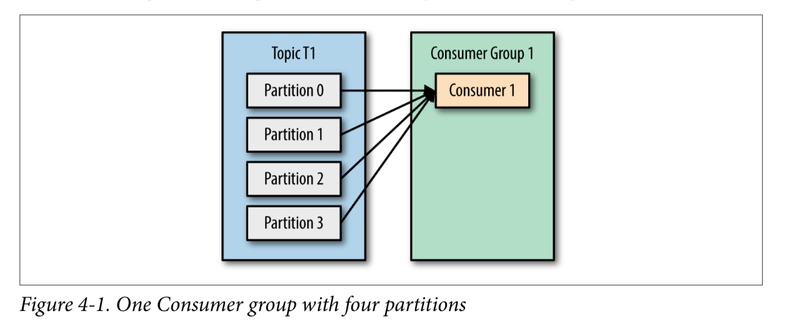
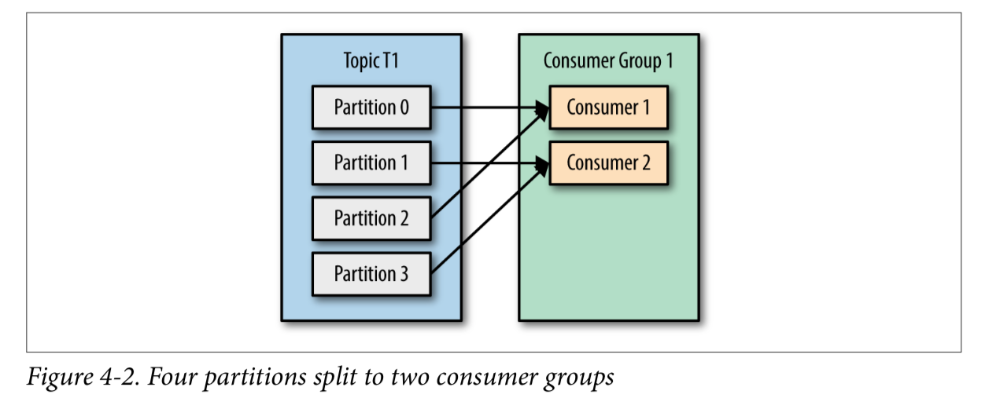
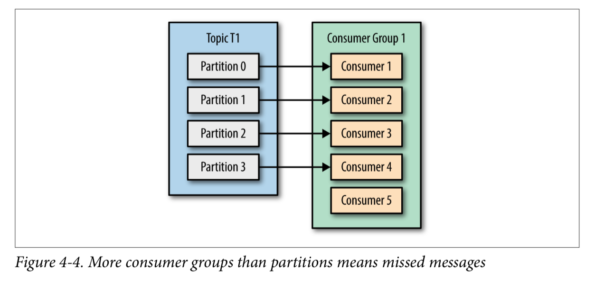
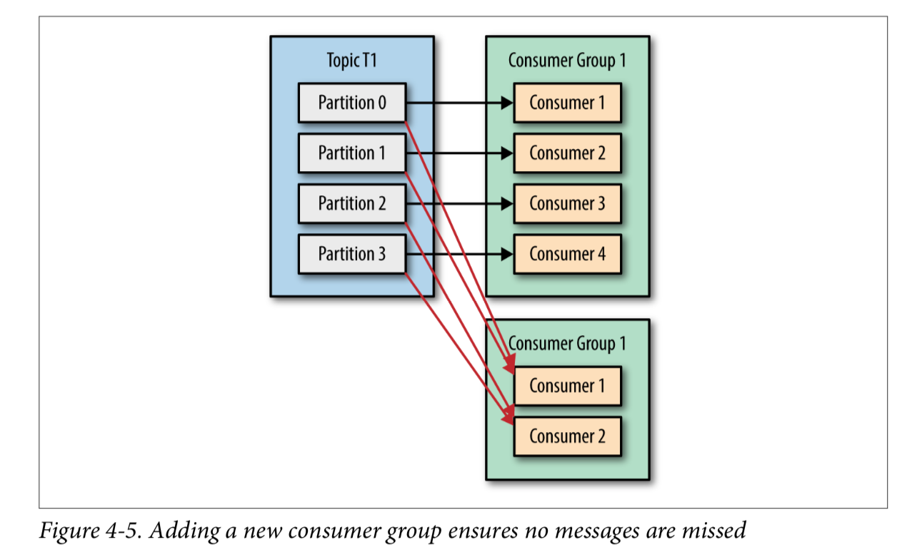
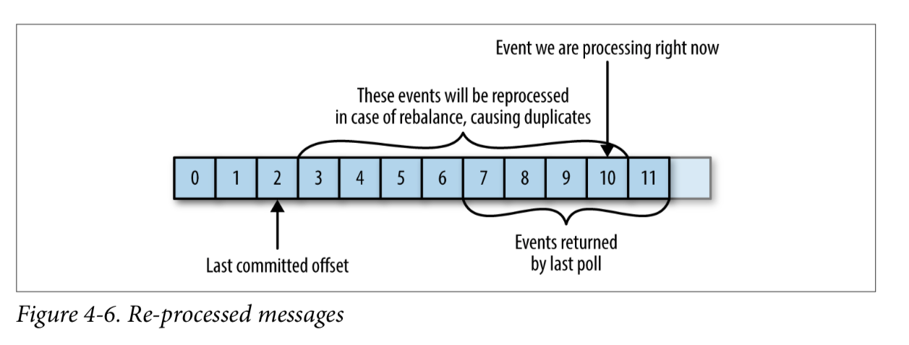
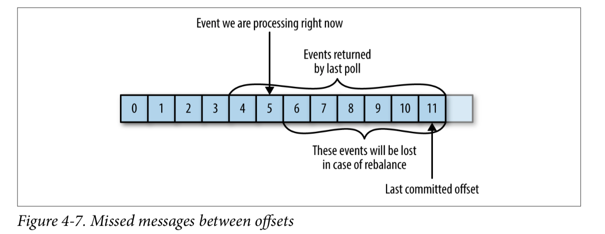

# Kafka Consumers: Reading Data from Kafka

- Applications that need to read data from Kafka use a KafkaConsumer to subscribe to Kafka topics and receive messages from these topics

- Reading data from Kafka is a bit different than reading data from other messaging systems


## Kafka Consumer Concepts

### Consumers and Consumer Groups

- What if the rate at which producers write messages to the topic exceeds the rate at which your application can validate them?

- Just like multiple producers can write to the same topic, we need to allow multiple consumers to read from the same topic, splitting the data between them.

- Kafka consumers are typically part of a consumer group. When multiple consumers are subscribed to a topic and belong to the same consumer group, each consumer in the group will receive messages from a different subset of the partitions in the topic.

- How consumer groups behave ? 

  - Consumer Group 1 will take all messages from T1:

    

  - Consumer Group 1 will split the partitions messages between the consumers in consumer group:

    

  - If we add more consumers to a single group with a single topic than we have partitions, some of the consumers will be idle and get no messages at all:

    

  - The main way we scale data consumption from a Kafka topic is by adding more consumers to a consumer group. This is a good reason to create topics with a large number of partitions—it allows adding more consumers when the load increases.

- How to scale for different applications subscribed to the same topic ?

  - By creating another consumer group for the other application:

    

- To summarize, you create a new consumer group for each application that needs all the messages from one or more topics. You add consumers to an existing consumer group to scale the reading and processing of messages from the topics, so each additional consumer in a group will only get a subset of the messages.


### Consumer Groups and Partition Rebalance

- When a consumer shuts down or crashes, it leaves the group, and the partitions it used to consume will be consumed by one of the remaining consumers. Reassignment of partitions to consumers also happen when the topics the consumer group is consuming are modified (e.g., if an administrator adds new partitions).

- Moving partition ownership from one consumer to another is called a **rebalance**.
  - They are important because they provide the consumer group with high availability and scalability (allowing us to easily and safely add and remove consumers)
  - During a rebalance, con‐ sumers can’t consume messages, so a rebalance is basically a short window of unavailability of the entire consumer group
  - When partitions are moved from one consumer to another, the consumer loses its current state; if it was caching any data, it will need to refresh its caches—slowing down the application until the con‐ sumer sets up its state again

- The way consumers maintain membership in a consumer group and ownership of the partitions assigned to them is by sending heartbeats to a Kafka broker designated as the group coordinator

- Kafka 0.10.1 or later: if you need to handle records that take longer to process, you simply need to tune `max.poll.interval.ms` so it will handle longer delays between polling for new records.


## Creating a Kafka Consumer

- Creating a KafkaConsumer is very similar to creating a KafkaProducer—you create a Java Properties instance with the properties you want to pass to the consumer

- To start we just need to use the three mandatory properties: `bootstrap.servers`, `key.deserializer`, and `value.deserializer`.
- The property is `group.id` is not mandatory, but it's very important. It specifies the consumer group the KafkaConsumer instance belongs to.

- How to create a Kafka consumer ?

```java

Properties props = new Properties();
    props.put("bootstrap.servers", "broker1:9092,broker2:9092");
    props.put("group.id", "CountryCounter");
    props.put("key.deserializer",
      "org.apache.kafka.common.serialization.StringDeserializer");
    props.put("value.deserializer",
      "org.apache.kafka.common.serialization.StringDeserializer");
    KafkaConsumer<String, String> consumer = new KafkaConsumer<String,
    String>(props);

```

### Subscribing to Topics

- How to subscribe into topics?

  - List of topics

    ```java
    consumer.subscribe(Collections.singletonList("customerCountries"));
    ```

  - Regular expression

    ```java
    consumer.subscribe("test.*");
    ```
    The expression can match multiple topic names, and if someone creates a new topic with a name that matches, a rebalance will happen almost immediately and the consumers will start consuming from the new topic. 

### The Poll Loop

At the heart of the consumer API is a simple loop for polling the server for more dat. Once the consumer subscribes to topics, the poll loop handles all details of coordina‐ tion, partition rebalances, heartbeats, and data fetching, leaving the developer with a clean API that simply returns available data from the assigned partitions.

```java

try {
      while (true) { 1
          ConsumerRecords<String, String> records = consumer.poll(100) 2;
          for (ConsumerRecord<String, String> record : records) 3
          {
              log.debug("topic = %s, partition = %s, offset = %d,
                customer = %s, country = %s\n",
                record.topic(), record.partition(), record.offset(),
                record.key(), record.value());
              int updatedCount = 1;
              if (custCountryMap.countainsValue(record.value())) {
                  updatedCount = custCountryMap.get(record.value()) + 1;
              }
              custCountryMap.put(record.value(), updatedCount)
              JSONObject json = new JSONObject(custCountryMap);
              System.out.println(json.toString(4)) 4
          }
}
} finally {
  consumer.close(); 5
}

```

1. Infinite Loop

2. This is the most important line in the chapter. The same way that sharks must keep moving or they die, consumers must keep polling Kafka or they will be con‐ sidered dead and the partitions they are consuming will be handed to another consumer in the group to continue consuming. The parameter we pass, poll(), is a timeout interval and controls how long poll() will block if data is not avail‐ able in the consumer buffer. If this is set to 0, poll() will return immediately; otherwise, it will wait for the specified number of milliseconds for data to arrive from the broker.
3. each poll returns a list of records. poll() returns a list of records. Each record contains the topic and partition the record came from, the offset of the record within the partition, and of course the key and the value of the record
4. Processing usually ends in writing a result in a data store or updating a stored record.
5. Always close() the consumer before exiting. This will close the network connec‐ tions and sockets. It will also trigger a rebalance immediately rather than wait for the group coordinator to discover that the consumer stopped sending heartbeats and is likely dead, which will take longer and therefore result in a longer period of time in which consumers can’t consume messages from a subset of the parti‐ tions.

The poll loop does a lot more than just get data. The first time you call poll() with a new consumer, it is responsible for finding the GroupCoordinator, joining the con‐ sumer group, and receiving a partition assignment. If a rebalance is triggered, it will be handled inside the poll loop as well. And of course the heartbeats that keep con‐ sumers alive are sent from within the poll loop. For this reason, we try to make sure that whatever processing we do between iterations is fast and efficient.

Note: Thread Safety
You can’t have multiple consumers that belong to the same group in one thread and you can’t have multiple threads safely use the same consumer. One consumer per thread is the rule. To run multiple consumers in the same group in one application, you will need to run each in its own thread. It is useful to wrap the consumer logic in its own object and then use Java’s ExecutorService to start multiple threads each with its own consumer. The Confluent blog has a tutorial that shows how to do just that.

### Configuring Consumers

http://kafka.apache.org/documentation.html#newconsumerconfigs

Important configs:
  - `fetch.min.bytes`: This property allows a consumer to specify the minimum amount of data that it wants to receive from the broker when fetching records.
  
  - `fetch.max.wait.ms`: By setting fetch.min.bytes, you tell Kafka to wait until it has enough data to send before responding to the consumer. fetch.max.wait.ms lets you control how long to wait.
  
  - `max.partition.fetch.bytes`: This property controls the maximum number of bytes the server will return per parti‐ tion.

  - `session.timeout.ms`: The amount of time a consumer can be out of contact with the brokers while still considered alive defaults to 3 seconds.

  - `auto.offset.reset`: This property controls the behavior of the consumer when it starts reading a partition for which it doesn’t have a committed offset or if the committed offset it has is invalid (usually because the consumer was down for so long that the record with that offset was already aged out of the broker).

  - `enable.auto.commit`: This parameter controls whether the consumer will commit offsets automatically, and defaults to true.

  - `partition.assignment.strategy`: A PartitionAssignor is a class that, given consumers and topics they subscribed to, decides which partitions will be assigned to which consumer.

  - `client.id`: This can be any string, and will be used by the brokers to identify messages sent from the client. It is used in logging and metrics, and for quotas.

  - `max.poll.records`: This controls the maximum number of records that a single call to poll() will return.

  - `receive.buffer.bytes and send.buffer.bytes`: These are the sizes of the TCP send and receive buffers used by the sockets when writing and reading data.


## Commits and Offsets

- Whenever we call poll(), it returns records written to Kafka that consumers in our group have not read yet. This means that we have a way of tracking which records were read by a consumer of the group. As discussed before, one of Kafka’s unique characteristics is that it does not track acknowledgments from consumers the way many JMS queues do. Instead, it allows consumers to use Kafka to track their position (offset) in each partition.

- We call the action of updating the current position in the partition a `commit`

- How does a consumer commit an offset?
  - It produces a message to Kafka, to a special `__consumer_offsets` topic, with the committed offset for each partition.
  - In rebalances,  in order to know where to pick up the work, the consumer will read the latest committed offset of each partition and continue from there.
  - If the committed offset is smaller than the offset of the last message the client pro‐ cessed, the messages between the last processed offset and the committed offset will be processed twice.

    

  - If the committed offset is larger than the offset of the last message the client actually processed, all messages between the last processed offset and the committed offset will be missed by the consumer group.
  
    

- Clearly, managing offsets has a big impact on the client application. The KafkaConsumer API provides multiple ways of committing offsets

#### Automatic Commit

- `enable.auto.commit=true`: Every five seconds the consumer will commit the largest offset your client received from poll()
- Has some drawbacks. Your messages might be processed twice when a rebalance occurs
- Automatic commits are convenient, but they don’t give developers enough control to avoid duplicate messages.

#### Commit Current Offset

- The simplest and most reliable of the commit APIs is commitSync(). This API will commit the latest offset returned by poll() and return once the offset is committed, throwing an exception if commit fails for some reason.
- It is important to remember that commitSync() will commit the latest offset returned by poll(), so make sure you call commitSync() after you are done processing all the records in the collection, or you risk missing messages as described previously. When rebalance is triggered, all the messages from the beginning of the most recent batch until the time of the rebalance will be processed twice.

#### Asynchronous Commit

- One drawback of manual commit is that the application is blocked until the broker responds to the commit request. This will limit the throughput of the application. Throughput can be improved by committing less frequently, but then we are increasing the number of potential duplicates that a rebalance will create.

- Another option is the asynchronous commit API. Instead of waiting for the broker to respond to a commit, we just send the request and continue on

- The drawback is that while commitSync() will retry the commit until it either suc ceeds or encounters a nonretriable failure, commitAsync() will not retry.

- Retrying Async Commits: A simple pattern to get commit order right for asynchronous retries is to use a monotonically increasing sequence number. Increase the sequence number every time you commit and add the sequence number at the time of the commit to the commitAsync callback. When you’re getting ready to send a retry, check if the commit sequence number the callback got is equal to the instance variable; if it is, there was no newer commit and it is safe to retry. If the instance sequence number is higher, don’t retry because a newer commit was already sent.


#### Combining Synchronous and Asynchronous Commits

- Normally, occasional failures to commit without retrying are not a huge problem because if the problem is temporary, the following commit will be successful.But if we know that this is the last commit before we close the consumer, or before a reba‐ lance, we want to make extra sure that the commit succeeds.

- Therefore, a common pattern is to combine commitAsync() with commitSync() just before shutdown.

#### Commit Specified Offset

- Committing the latest offset only allows you to commit as often as you finish processing batches.

- The consumer API allows you to call commitSync() and commitAsync() and pass a map of partitions and offsets that you wish to commit.

#### Rebalance Listeners

- A consumer will want to do some cleanup work before exiting and also before partition rebalancing.

- The consumer API allows you to run your own code when partitions are added or removed from the consumer. You do this by passing a ConsumerRebalanceListener when calling the subscribe() method we discussed previously.

- `public void onPartitionsRevoked(Collection<TopicPartition> partitions)`: Called before the rebalancing starts and after the consumer stopped consuming messages. This is where you want to commit offsets, so whoever gets this parti‐ tion next will know where to start.

- `public void onPartitionsAssigned(Collection<TopicPartition> partitions)`: Called after partitions have been reassigned to the broker, but before the con‐ sumer starts consuming messages.

#### Consuming Records with Specific Offsets

- So far we’ve seen how to use poll() to start consuming messages from the last com‐ mitted offset in each partition and to proceed in processing all messages in sequence. However, sometimes you want to start reading at a different offset.

- If you want to start reading all messages from the beginning of the partition, or you want to skip all the way to the end of the partition and start consuming only new messages, there are APIs specifically for that: seekToBeginning(TopicPartition tp) and seekToEnd(TopicPartition tp)

- The Kafka API also lets you seek a specific offset. This ability can be used in a variety of ways; for example, to go back a few messages or skip ahead a few messages

- See example page 84

- TL;DR: There are many different ways to implement exactly-once semantics by storing offsets and data in an external store, but all of them will need to use the ConsumerRebalance Listener and seek() to make sure offsets are stored in time and that the consumer starts reading messages from the correct location.


### But How Do We Exit?

- When you decide to exit the poll loop, you will need another thread to call `consumer.wakeup()`. Note that consumer.wakeup() is the only consumer method that is safe to call from a different thread.

- If you are running the consumer loop in the main thread, this can be done from ShutdownHook

- Calling wakeup will cause poll() to exit with WakeupException, or if consumer.wakeup() was called while the thread was not waiting on poll, the exception will be thrown on the next iteration when poll() is called. The WakeupException doesn’t need to be handled, but before exiting the thread, you must call consumer.close()

- Closing the consumer will commit offsets if needed and will send the group coordinator a message that the consumer is leaving the group. The consumer coordinator will trigger rebalancing immediately and you won’t need to wait for the session to time out before partitions from the con‐ sumer you are closing will be assigned to another consumer in the group.

-  example: http://bit.ly/2u47e9A

### Deserializers

- Kafka producers require serializers to convert objects into byte arrays that are then sent to Kafka. Similarly, Kafka consumers require deserializers to convert byte arrays recieved from Kafka into Java objects

#### Custom deserializers

- See example page 89

- It is important to note that implementing a custom serializer and deserializer is not recommended. It tightly couples producers and consumers and is fragile and error-prone. A better solution would be to use a standard message format such as JSON, Thrift, Protobuf, or Avro. We’ll now see how to use Avro deserializers with the Kafka consumer.

#### Using Avro deserialization with Kafka consumer

- See example page 91

### Standalone Consumer: Why and How to Use a Consumer Without a Group

- Sometimes you know you have a single consumer that always needs to read data from all the partitions in a topic, or from a specific partition in a topic. In this case, there is no reason for groups or rebalances just assign the consumer-specific topic and/or partitions, consume messages, and commit offsets on occasion.

- When you know exactly which partitions the consumer should read, you don’t `subscribe` to a topic—instead, you `assign` yourself a few partitions. A consumer can either subscribe to topics (and be part of a consumer group), or assign itself partitions, but not both at the same time.

## Summary

- Kafka’s consumer groups and the way they allow multiple consumers to share the work of reading events from topics.

- Practical example of a consumer subscribing to a topic and continuously reading events

- Most important consumer configuration parameters and how they affect consumer behavior.

- Offsets and how consumers keep track of them.

- Understanding how consumers commit offsets is critical when writing reliable consumers, so we took time to explain the different ways this can be done.

- Consumer APIs, handling rebalances and closing the consumer.

-  Deserializers used by consumers to turn bytes stored in Kafka into Java objects that the applications can process.

- Avro deserializers in some detail, even though they are just one type of deserializer you can use, because these are most commonly used with Kafka


