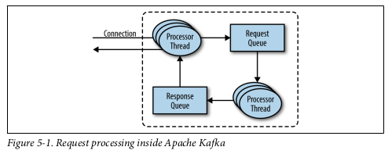
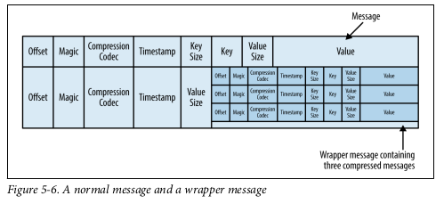

# Kafka Internals

- How Kafka replication works.

- How Kafka handles requests from producers and consumers.

- How handles storage such as file format and indexes.

### Cluster Membership

- Zookeeper maintain list of brokers.

- Each broker has a unique identifier (set in broker config file or automatically generated).

- Broker register itself in Zookeeper by creating an **ephemeral node**.

- If try to create same broker ID on Zookeeper it generates an error.

### The Controller

- The controller is one of the Kafka brokers, it is responsible for electing partitions leaders.

- When first broker starts the cluster:

    - Creates an ephemeral node in Zookeeper (unique).
    
    - Broker become the new controller.
    
- When another brokers start:

    - Try to create an ephemeral node -> It will receive an error: "Node already exists".
    
    - Broker creates in Zookeeper an **keeper watch**.
     
    - Broker will receive notification about changes on controller node.
    
 - Cluster will have one controller at a time.
 
 - If controller broker stopped, the ephemeral node will disappear. 
 
    - Other brokers are notified by Zookeeper watch about the incident
    
    - Other brokers will attempt to create the controller node
    
    - The first node to create the new controller in Zookeeper is the new controller
    
    - Every time that a controller is elected, it receives a new, higher **controller epoch** number.
    
    - **Controller epoch** number avoids the scenario where two nodes believe each is the current controller.
 
 - Controller verifies if all partitions has a leader. If some broker left the cluster, controller is responsible to determines who will be the new leader.
 
### Replication

- Kafka is described as distributed, partitioned, replicated commit log service.

- Kafka guarantees availability and durability when nodes fail.

- There are two types of replicas:

    - Leader replica: Each partition has a single replica designated as the leader.
    
    - Follower replica: All partitions which are not the leader are called followers. It only replicates messages from a leader and stay up-to-date. If leader crashes, one of the follower replica will be promoted to become the new leader.

 - Leader should track if all replicas are in sync. Followers are sync by replicating all messages. 
 
    - Replicas send **FETCH** requests to the leader.
    
    - It always receives messages in order. So leader knows by looking the offset which replica is on sync.
    
    - Only in-sync replicas are elective to become a leader.
    
    - *replica.lag.time.max.ms*: max of time that a follwes has to be considered out-of-sync.
    
    - A preferred leader: The replica that was the leader when the topic was originally created.
    
    - *auto.leader.rebalance.enable=true*: check if the preferred leader replica is not the current leader but is in-sync and trigger leader election to make the preferred leader the current leader
    
## Request Processing
Kafka has a binary protocol (over TCP) that specifies the format of the requests and how brokers respond to them

- Some standard header

    - Request type (also called API key).

    - Request version (so the brokers can handle clients of different versions and respond accordingly).
 
    - Correlation ID: a number that uniquely identifies the request and also appears in the response and in the error logs.
 
    - Client ID: used to identify the application that sent the request.
    
- Network threads is configurable. The network threads are responsible for taking requests from client connections, placing them in a request queue, and picking up responses from a response queue and sending them back to clients.

   

### Produce Requests

- Sent by producers and contain messages the clients write to Kafka brokers.

- There is **acks** parameter to defines if messages was “written successfully”

    - acks=0 : no need to be accepted.

    - acks=1 : need to be accepted just by the leader.
     
    - acks=all : need to be accepted by all in-sync replicas.
    
- Once message is written to the leader of the partition, if acks=0 || acks=1 the broker will respond immediately success. Otherwise, the request will be stored in a buffer called **purgatory** until all replicasr eplicated the message.

### Fetch Requests

-Sent by consumers and follower replicas when they read messages from Kafka brokers.

- It asks the broker to send messages from a list of topics, partitions, and offsets;

    - Example: "Please send me messages starting at offset 53 in partition 0 of topic Test and messages starting at offset 64 in partition 3 of topic Test."

- Clients also specify a limit to how much data the broker can return on each partition in order to avoid run out of memory.

    - Clients can also set a lower boundary on the amount of data returned. This mean clients can specify a minimum value of data to received at once, for example 10k bytes. This can reduce CPU and network utilization.
    
    - If the messages arrived do not satisfy the minimum amount of data, it will wait a defined amount of time X to send the messages.

    
 
-  We already discussed that the leader of the partition knows which messages were replicated to which replica, and until a message was written to all in-sync replicas, it will not be sent to consumers—attempts to fetch those messages will result in an empty response rather than an error.

    - If consumer reads a message from leader that it is not replicated yet, if leader fails no other broker contained this message.
  
     
    
    
### Other Requests

- The Kafka protocol currently handles 20 different request types, and more will be
added. 

- In the past, kafka Consumers used Apache Zookeeper to keep track of the offsets they receive from Kafka. So when a consumer is started, it can check Zookeeper for the last offset that was read from its partitions and know where to start processing. For various reasons, we decided to stop using Zookeeper for this, and instead store those offsets in a special Kafka topic. In order to do this, we had to add several requests to the protocol:

        -OffsetCommitRequest
        -Offset
        -FetchRequest
        -ListOffsetsRequest
         
- Now when an application calls the commitOffset() client API, the client no longer writes to Zookeeper; instead, it sends OffsetCommitRequest to Kafka.

- In release 0.10.0 we added ApiVersionRequest which allows clients to ask broker which version each request is supported.

- Tip: Upgrade the brokers before upgrading any of the clients.

    - Higher version of brokers can handle with a current message version and below while clients can send just one type version of messages.

## Physical Storage

- The basic storage unit of Kafka is a partition replica.

- log.dirs: defines a list of directories in which partitions will be stored.

### Partition Allocation

- When you create a topic, Kafka first decides how to allocate the partitions between brokers.

- Goals to allocate partitions:

    - To spread replicas evenly among brokers.
     
    - To make sure that for each partition, each replica is on a different broker.
    
    - If the brokers have rack information (available in Kafka release 0.10.0 and higher), then assign the replicas for each partition to different racks if possible.

- This ensures that an event that causes downtime for an entire rack does not cause complete unavailability for partitions.
    
     

### File Management

- Retention is an important concept in Kafka
 
    - It does not keep data forever, there is a configuration called **retention period** for each topic.

- Deletions is never made on an active segment (segment that is current writing)

### File Format

- Example of wrapper message containing three compressed messages:

   
   
- It is recommended to use compression on producer

  - Sending larger batches means better compression both over the network and on the broker disks. This also means that if we decide to change the message format that consumers use (e.g., add a timestamp to the message), both the wire protocol and the on-disk format need to change, and Kafka brokers need to know how to handle cases in which files contain messages of two formats due to upgrades.

### Indexes

  - Kafka maintains an index for each partition. In order to kick respond to consumers while fetching message from any available offset.
  
  - Kafka do not maintain checksums
    
    - If the index becomes corrupted, it will get regenerated by rereading the messages and recording the offsets and locations.
    
    - It is also enable to delete index segments, indexes will be regenerated automatically.

### Compaction

 - Compaction is used when the latest message value is more important among others in a timeline. For example customer address.
 
 - Kafka supports such use cases by allowing the retention policy on a topic to be delete, which deletes events older than retention time, to compact, which only stores the most recent value for each key in the topic.

### How Compaction Works

- There are two portions:

    - Clean: Messages that have been compacted before. Stores only one value for each key.
    
    - Dirty: Messages that were written after the last compaction.

    

- To compact a partition, the cleaner thread reads the dirty section of the partition and creates an in-memory map. Each map entry is comprised of a 16-byte hash of a message key and the 8-byte offset of the previous message that had this same key. This means each map entry only uses 24 bytes. If we look at a 1 GB segment and assume that each message in the segment takes up 1 KB, the segment will contain 1 million such messages and we will only need a 24 MB map to compact the segment (we may need a lot less—if the keys repeat themselves, we will reuse the same hash entries often and use less memory).

    

### Delete Events

- Create a message that contains that key and a null value. When the cleaner thread finds such a message, it will first do a normal compaction and retain only the message with the null value. It will keep this special message (known as a **tombstone**).

- During this time, consumers will be able to see this message and know that the value is deleted. So if a consumer copies data from Kafka to a relational database, it will see the tombstone message and know to delete the user from the database.

- It is important to give consumers enough time to see the tombstone message in order to propagate this information in a database.

### When Are Topics Compacted

- the compact policy never compacts the current segment. Messages are eligble for compaction only on inactive segments.