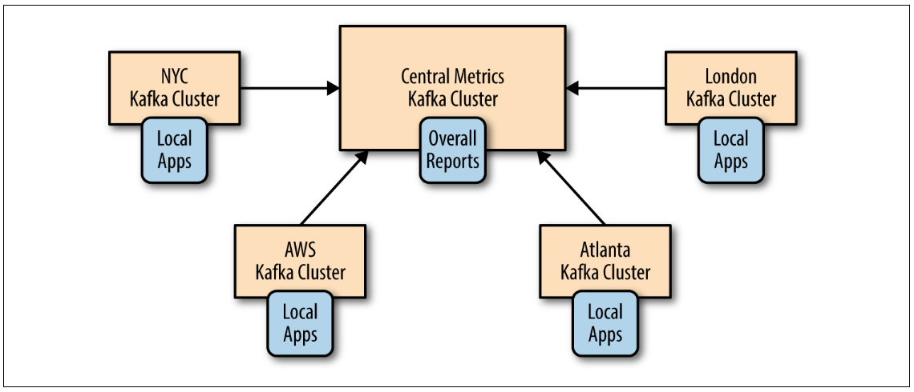
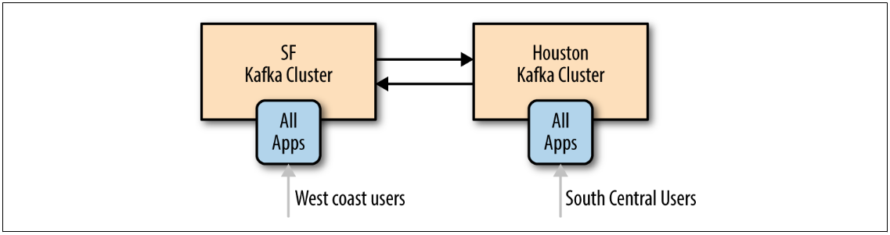
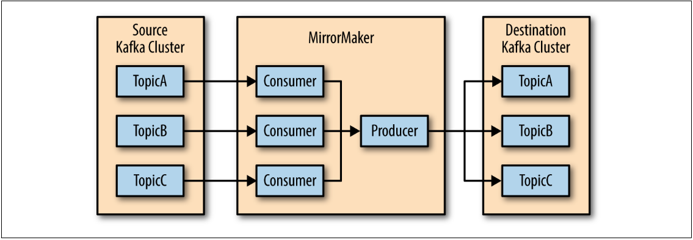

# Cross-Cluster Data Mirroring
In this chapter we will discuss cross-cluster mirroring of all or part of the data. We’ll
start by discussing some of the common use cases for cross-cluster mirroring. Then
we’ll show a few architectures that are used to implement these use cases and discuss
the pros and cons of each architecture pattern. We’ll then discuss MirrorMaker itself
and how to use it. We’ll share operational tips, including deployment and perfor‐
mance tuning. We’ll finish by discussing a few alternatives to MirrorMaker.

## Use Cases of Cross-Cluster Mirroring
* Regional and central clusters

In some cases, the company has one or more datacenters in different geographi‐
cal regions, cities, or continents. Each datacenter has its own Kafka cluster. Some
applications can work just by communicating with the local cluster, but some
applications require data from multiple datacenters (otherwise, you wouldn’t be
looking at cross data-center replication solutions).
* Redundancy (DR)

The applications run on just one Kafka cluster and don’t need data from other
locations, but you are concerned about the possibility of the entire cluster
becoming unavailable for some reason. You’d like to have a second Kafka cluster
with all the data that exists in the first cluster, so in case of emergency you can
direct your applications to the second cluster and continue as usual
* Cloud migrations

Many companies these days run their business in both an on-premise datacenter
and a cloud provider. Often, applications run on multiple regions of the cloud
provider, for redundancy, and sometimes multiple cloud providers are used. In
these cases, there is often at least one Kafka cluster in each on-premise datacenter
and each cloud region. Those Kafka clusters are used by applications in each
datacenter and region to transfer data efficiently between the datacenters.

## Some Realities of Cross-Datacenter Communication

* High Latencies
* Limited Bandwidth
* Higher Costs

In most cases, it’s best to avoid producing data to a remote datacenter, and when you
do, you need to account for higher latency and the potential for more network errors.
You can handle the errors by increasing the number of producer retries and handle
the higher latency by increasing the size of the buffers that hold records between
attempts to send them.

We’ll talk more about tuning Kafka for cross-datacenter communication, but the fol‐
lowing principles will guide most of the architectures we’ll discuss next:
• No less than one cluster per datacenter
• Replicate each event exactly once (barring retries due to errors) between each
pair of datacenters
• When possible, consume from a remote datacenter rather than produce to a
remote datacenter

## Hub-and-Spokes Architecture

A simpler version of the hub-and-spokes architecture

This architecture is used when data is produced in multiple datacenters and some
consumers need access to the entire data set. The architecture also allows for applica‐
tions in each datacenter to only process data local to that specific datacenter. But it
does not give access to the entire data set from each datacenter.

**The main benefit** of this architecture is that data is always produced to the local data-
center and that events from each datacenter are only mirrored once—to the central
datacenter. Applications that process data from a single datacenter can be located at
that datacenter. Applications that need to process data from multiple datacenters will
be located at the central datacenter where all the events are mirrored. Because replica‐
tion always goes in one direction and because each consumer always reads from the
same cluster, this architecture is simple to deploy, configure, and monitor.

**The main drawbacks** of this architecture are the direct results of its benefits and sim‐
plicity. Processors in one regional datacenter can’t access data in another.

## Active-Active Architecture
This architecture is used when two or more datacenters share some or all of the data
and each datacenter is able to both produce and consume events.

**The main benefits** of this architecture are the ability to serve users from a nearby
datacenter, which typically has performance benefits, without sacrificing functionality
due to limited availability of data (as we’ve seen happen in the hub-and-spokes archi‐
tecture). A secondary benefit is redundancy and resilience. Since every datacenter has
all the functionality, if one datacenter is unavailable you can direct users to a remain‐
ing datacenter. This type of failover only requires network redirects of users, typically
the easiest and most transparent type of failover.

**The main drawback** of this architecture is the challenges in avoiding conflicts when
data is read and updated asynchronously in multiple locations. This includes techni‐
cal challenges in mirroring events—for example, how do we make sure the same
event isn’t mirrored back and forth endlessly? But more important, maintaining data
consistency between the two datacenters will be difficult.

## Active-Standby Architecture

In some cases, the only requirement for multiple clusters is to support some kind of
disaster scenario. Perhaps you have two clusters in the same datacenter. You use one
cluster for all the applications, but you want a second cluster that contains (almost)
all the events in the original cluster that you can use if the original cluster is 
completely unavailable.Or perhaps you need geographic resiliency. Your entire business
is running from a datacenter in California, but you need a second datacenter in Texas 
that usually doesn’t do much and that you can use in case of an earthquake.

The benefits of this setup is simplicity in setup and the fact that it can be used in
pretty much any use case. You simply install a second cluster and set up a mirroring
process that streams all the events from one cluster to another. No need to worry
about access to data, handling conflicts, and other architectural complexities.

The disadvantages are waste of a good cluster and the fact that failover between Kafka
clusters is, in fact, much harder than it looks. The bottom line is that it is currently
not possible to perform cluster failover in Kafka without either losing data or having
duplicate events. Often both. You can minimize them, but never fully eliminate them.

It should be obvious that a cluster that does nothing except wait around for a disaster
is a waste of resources. Since disasters are (or should be) rare, most of the time we are
looking at a cluster of machines that does nothing at all. Some organizations try to
fight this issue by having a DR (disaster recovery) cluster that is much smaller than
the production cluster. But this is a risky decision because you can’t be sure that this
minimally sized cluster will hold up during an emergency. Other organizations prefer
to make the cluster useful during non-disasters by shifting some read-only workloads
to run on the DR cluster, which means they are really running a small version of a
hub-and-spoke architecture with a single spoke.

The more serious issue is, how do you failover to a DR cluster in Apache Kafka?

First, it should go without saying that whichever failover method you choose, your
SRE team must practice it on a regular basis. A plan that works today may stop work‐
ing after an upgrade, or perhaps new use cases make the existing tooling obsolete.
Once a quarter is usually the bare minimum for failover practices. Strong SRE teams
practice far more frequently. Netflix’s famous Chaos Monkey, a service that randomly
causes disasters, is the extreme—any day may become failover practice day.

## Data loss and inconsistencies in unplanned failover

Because Kafka’s various mirroring solutions are all asynchronous (we’ll discuss a syn‐
chronous solution in the next section), the DR cluster will not have the latest mes‐
sages from the primary cluster. You should always monitor how far behind the DR
cluster is and never let it fall too far behind. But in a busy system you should expect
the DR cluster to be a few hundred or even a few thousand messages behind the pri‐
mary. If your Kafka cluster handles 1 million messages a second and there is a 5 milli‐
second lag between the primary and the DR cluster is 5 milliseconds, your DR cluster
will be 5,000 messages behind the primary in the best-case scenario. So prepare for
unplanned failover to include some data loss. In planned failover, you can stop the
primary cluster and wait for the mirroring process to mirror the remaining messages
before failing over applications to the DR cluster, thus avoiding this data loss. When
unplanned failover occurs and you lose a few thousand messages, note that Kafka
currently has no concept of transactions, which means that if some events in multiple
topics are related to each other (e.g., sales and line-items), you can have some events
arrive to the DR site in time for the failover and others that don’t. Your applications
will need to be able to handle a line item without a corresponding sale after you fail‐
over to the DR cluster.

## Start offset for applications after failover
Perhaps the most challenging part in failing over to another cluster is making sure
applications know where to start consuming data. There are several common
approaches.

* Auto offset reset

Apache Kafka consumers have a configuration for how to behave when they
don’t have a previously committed offset—they either start reading from the
beginning of the partition or from the end of the partition. If you are using old
consumers that are committing offsets to Zookeeper and you are not somehow
mirroring these offsets as part of the DR plan, you need to choose one of these
options. Either start reading from the beginning of available data and handle
large amounts of duplicates or skip to the end and miss an unknown (and hope‐
fully small) number of events. If your application handles duplicates with no
issues, or missing some data is no big deal, this option is by far the easiest. Simply
skipping to the end of the topic on failover is probably still the most popular fail‐
over method.

* Replicate offsets topic

If you are using new (0.9 and above) Kafka consumers, the consumers will com‐
mit their offsets to a special topic: __consumer_offsets . If you mirror this topic 
to your DR cluster, when consumers start consuming from the DR cluster they 
will be able to pick up their old offsets and continue from where they left off. It is
simple, but there is a long list of caveats involved.

First, there is no guarantee that offsets in the primary cluster will match those in
the secondary cluster. Suppose you only store data in the primary cluster for
three days and you start mirroring a topic a week after it was created. In this case
the first offset available in the primary cluster may be offset 57000000 (older
events were from the first 4 days and were removed already), but the first offset
in the DR cluster will be 0. So a consumer that tries to read offset 57000003
(because that’s its next event to read) from the DR cluster will fail to do this.

Second, even if you started mirroring immediately when the topic was first cre‐
ated and both the primary and the DR topics start with 0, producer retries can
cause offsets to diverge. Simply put, there is no existing Kafka mirroring solution
that preserves offsets between primary and DR clusters.

Third, even if the offsets were perfectly preserved, because of the lag between pri‐
mary and DR clusters and because Kafka currently lacks transactions, an offset
committed by a Kafka consumer may arrive ahead or behind the record with this
offset. A consumer that fails over may find committed offsets without matching
records. Or it may find that the latest committed offset in the DR site is older
than the latest committed offset in the primary site.

* Time-based failover

If you are using really new (0.10.0 and above) Kafka consumers, each message
includes a timestamp indicating the time the message was sent to Kafka. In really
new Kafka versions (0.10.1.0 and above), the brokers include an index and an
API for looking up offsets by the timestamp. So, if you failover to the DR cluster
and you know that your trouble started at 4:05 A.M., you can tell consumers to
start processing data from 4:03 A.M. There will be some duplicates from those
two minutes, but it is probably better than other alternatives and the behavior is
much easier to explain to everyone in the company—“We failed back to 4:03
A.M.” sounds better than “We failed back to what may or may not be the latest
committed offsets.” So this is often a good compromise.

* External offset mapping

When discussing mirroring the offsets topic, one of the biggest challenges with
that approach is the fact that offsets in primary and DR clusters can diverge.
With this in mind, some organizations choose to use an external data store, such
as Apache Cassandra, to store mapping of offsets from one cluster to another.
They build their Kafka mirroring tool so that whenever an event is produced to
the DR cluster, both offsets are sent to the external datastore. Or they only store
both offsets whenever the difference between the two offsets changed. For exam‐
ple, if offset 495 on primary mapped to offset 500 on the DR cluster, we’ll record
(495,500) in the external store. If the difference changes later due to duplicates
and offset 596 is mapped to 600, then we’ll record the new mapping (596,600).

This solution is quite complex and in my opinion almost never worth the extra
effort. It dates back to before time indexes existed and could be used for failover.
These days I’d opt to upgrade the cluster and use the time-based solution rather
than go through the effort of mapping offsets, which still doesn’t cover all failover
cases.

* After failover

Let’s say that failover was successful. Everything is working just fine on the DR clus‐
ter. Now we need to do something with the primary cluster. Perhaps turn it into a DR.
It is tempting to simply modify the mirroring processes to reverse their direction and
simply start mirroring from the new primary to the old one. However, this leads to
two important questions:

• How do we know where to start mirroring? We need to solve the same problem
we have for all our consumers for the mirroring application itself. And remember
that all our solutions have cases where they either cause duplicates or miss data—
often both.

• In addition, for reasons we discussed above, it is likely that your original primary
will have events that the DR cluster does not. If you just start mirroring new data
back, the extra history will remain and the two clusters will be inconsistent.

For this reason, the simplest solution is to first scrape the original cluster—delete all
the data and committed offsets and then start mirroring from the new primary back
to what is now the new DR cluster. This gives you a clean slate that is identical to the
new primary.

## Stretch Clusters

Stretch clusters are fundamentally different from other multi-datacenter scenarios. To
start with, they are not multicluster—it is just one cluster. As a result, we don’t need a
mirroring process to keep two clusters in sync. Kafka’s normal replication mechanism
is used, as usual, to keep all brokers in the cluster in sync. This setup can include syn‐
chronous replication. Producers normally receive an acknowledgment from a Kafka
broker after the message was successfully written to Kafka.

This architecture is limited in the type of disasters it protects against. It only protects
from datacenter failures, not any kind of application or Kafka failures. The opera‐
tional complexity is also limited. This architecture demands physical infrastructure
that not all companies can provide.

This architecture is feasible if you can install Kafka (and Zookeeper) in at least three
datacenters with high bandwidth and low latency between them. This can be done if
your company owns three buildings on the same street, or—more commonly—by
using three availability zones inside one region of your cloud provider.

## Apache Kafka’s MirrorMaker

Apache Kafka contains a simple tool for mirroring data between two datacenters. It is
called MirrorMaker and at its core, it is a collection of consumers (called streams in
MirrorMaker documentation, for historical reasons), which are all part of the same
consumer group and read data from the set of topics you chose to replicate. Each
MirrorMaker process has a single producer. The workflow is pretty simple: Mirror‐
Maker runs a thread for each consumer. Each consumer consumes events from the
topics and partitions it was assigned on the source cluster and uses the shared pro‐
ducer to send those events to the target cluster. Every 60 seconds (by default), the
consumers will tell the producer to send all the events it has to Kafka and wait until
Kafka acknowledges these events. Then the consumers contact the source Kafka clus‐
ter to commit the offsets for those events. This guarantees no data loss (messages are
acknowledged by Kafka before offsets are committed to the source) and there is no
more than 60 seconds’ worth of duplicates if the MirrorMaker process crashes.

## Other Cross-Cluster Mirroring Solutions

We looked in depth at MirrorMaker because this mirroring software arrives as part of
Apache Kafka. However, MirrorMaker also has some limitations when used in prac‐
tice. It is worthwhile to look at some of the alternatives to MirrorMaker and the ways
they address MirrorMaker limitations and complexities.

## Uber uReplicator

Uber ran MirrorMaker at very large scale, and as the number of topics and partitions
grew and the cluster throughput increased, they started running into the following
problems:

* Rebalancing delays

MirrorMaker consumers are just consumers. Adding MirrorMaker threads,
adding MirrorMaker instances, bouncing MirrorMaker instances, or even adding
new topics that match the regular expression used in the whitelist all cause con‐
sumers to rebalance. As we saw in Chapter 4, rebalancing stops all the consumers
until new partitions can be assigned to each consumer. With a very large number
of topics and partitions, this can take a while. This is especially true when using
old consumers like Uber did. In some cases this caused 5-10 minutes of inactiv‐
ity, causing mirroring to fall behind and accumulate a large backlog of events to
mirror, which can take a long time to recover from. This caused very high latency
for consumers reading events from the destination cluster.

* Difficulty adding topics

Using a regular expression as the topic whitelist means that MirrorMaker will
rebalance every time someone adds a matching topic to the source cluster. We’ve
already seen that rebalances were particularly painful for Uber. To avoid this,
they decided to simply list every topic they need to mirror and avoid surprise
rebalances. But this means that they need to manually add new topics that they
want to mirror to the whitelist on all MirrorMaker instances and bounce the
instances, which leads to rebalances. At least those rebalances happen on sched‐
uled maintenance and not every time someone adds a topic, but it is still lots of
maintenance. This also means that if the maintenance isn’t done correctly and
different instances have different topic lists, MirrorMaker will start and endlessly
rebalance as the consumers won’t be able to agree on the topics they subscribe to.
Given these issues, Uber decided to write their own MirrorMaker clone, called uRe
plicator

## Confluent’s Replicator

At the same time that Uber developed their uReplicator, Confluent independently
developed Replicator. Despite the similarities in names, the projects have almost
nothing in common—they are different solutions to two different sets of Mirror‐
Maker problems. Confluent’s Replicator was developed to address issues their enter‐
prise customers encountered when using MirrorMaker to manage their multicluster
deployments.

* Diverging cluster configuration

While MirrorMaker keeps data in sync between source and destination, this is
the only thing it keeps in sync. Topics can end up with different numbers of par‐
titions, replication factors, and topic-level settings. Increasing topic retention
from one to three weeks on the source cluster and forgetting about the DR clus‐
ter can lead to a rather nasty surprise when you failover to the second cluster and
discover that a few weeks of data are now missing. Trying to manually keep all
these settings in sync is error-prone and can cause downstream applications, or
even replication itself, to fail if the systems fall out of sync.

* Cluster management challenges

We’ve already seen that MirrorMaker is typically deployed as a cluster of multiple
instances. This means yet another cluster to figure out how to deploy, monitor,
and manage. With two configuration files and a large number of parameters,
configuration management for MirrorMaker itself can be a challenge. This
increases if there are more than two clusters and one-direction replication. If you
have three active-active clusters, you have six MirrorMaker clusters to deploy,
monitor, and configure, and each of those likely has at least three instances. With
five active-active clusters, the number of MirrorMaker clusters increases to 20.
With the goal of minimizing administration overhead for busy enterprise IT depart‐
ments, Confluent decided to implement Replicator as a source connector for the
Kafka Connect framework, a source connector that reads data from another Kafka
cluster rather than from a database. If you recall the Kafka Connect architecture from
Chapter 7, you remember that each connector divides the work between a configura‐
ble number of tasks. In Replicator, each task is a consumer and a producer pair. The
Connect framework assigns those tasks to different Connect worker nodes as needed
—so you may have multiple tasks on one server or have the tasks spread out to multi‐
ple servers. This replaces the manual work of figuring out how many MirrorMaker
streams should run per instance and how many instances per machine.
Connect also
has a REST API to centrally manage the configuration for the connectors and tasks. If
we assume that most Kafka deployments include Kafka Connect for other reasons
(sending database change events into Kafka is a very popular use case), then by run‐
ning Replicator inside Connect, we can cut down on the number of clusters we need
to manage. The other significant improvement is that the Replicator connector, in
addition to replicating data from a list of Kafka topics, also replicates the configura‐
tion for those topics from Zookeeper.

