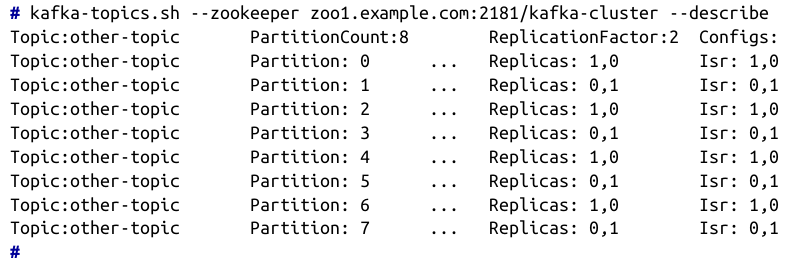
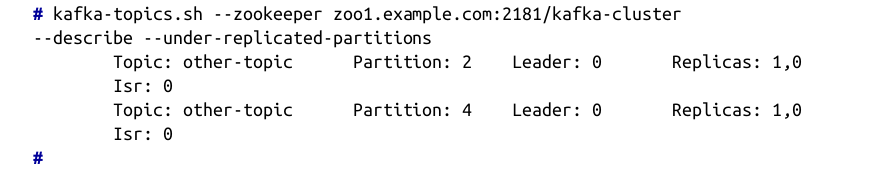
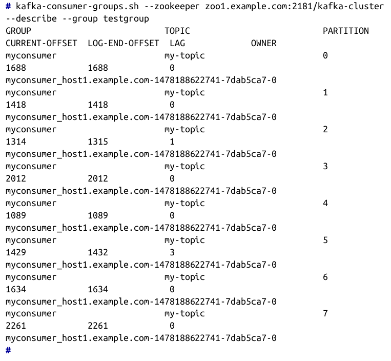
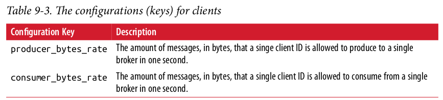
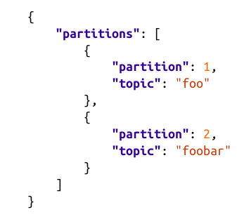
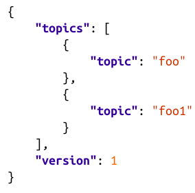

# Administering Kafka

- Kafka provides command-line interface (CLI) utilities in order to administrate clusters.

- **kafka-configs.sh** tool


### Topic Operations

Tool allows creation, listing, modifying and deletion of clusters. Command-lines tools for Kafka operates directly on the metadata stored in Zookeeper rather than connecting to the broker themselves.

#### Creating a New Topic

It requires three arguments to create a topic:

```console
kafka-topics.sh --zookeeper <zookeeper connect> --create --topic <string>
--replication-factor <integer> --partitions <integer>
```

- **Topic Name:** the name of the topic. It is permitted, but not recommended, to have topic names that start with two underscores. Topics of this form are considered internal topics for the cluster (such as the __consumer_offsets topic for the consumer group offset storage). 
It is also not recommended to use both periods and underscores in a single cluster because when the topic names are used in metric names inside Kafka, periods are changed to underscores (e.g., “topic.1” becomes “topic_1” in metrics).

- **Replication Factor:** The number of replicas of the topic to maintain within the cluster.

- **Partitions:** The number of replicas of the topic to maintain within the cluster.

```console
kafka-topics.sh --zookeeper zoo1.example.com:2181/kafka-cluster --create
--topic my-topic --replication-factor 2 --partitions 8
Created topic "my-topic".
```

- Use **--disable-rack-aware** command-line to disable the distribution of replicas for each partition be in separate racks.


#### Adding Partitions

- Partition are the way topic are scaled and replicated across a cluster.
- The main reason to increase partition is to spread out a topic further, or decrease the throughput for a single partition.
- Topics that are produced with keyed, which means the kafka partitioner will always send messages with the same key to the same partition and this will ensure the ordering of that particular set of messages. Resizing those partitions can be very difficult from a consumer’s point of view. This is because the mapping of keys to partitions will change when the number of partitions is changed. For this reason, it is advisable to set the number of partitions for a topic that will contain keyed messages once, when the topic is created, and avoid resizing the topic.
- It is NOT possible to reduce partitions to avoid lose of data. It requires to delete the topic and recreate it.

```console
kafka-topics.sh --zookeeper zoo1.example.com:2181/kafka-cluster
--alter --topic my-topic --partitions 16
WARNING: If partitions are increased for a topic that has a key,
the partition logic or ordering of the messages will be affected
Adding partitions succeeded!
```

#### Deleting a Topic
Deleting a topic will delete all its messages, it is irreversible operation. Just delete a topic with no messages in it uses cluster resources, including disk space, open filehandles, and memory.
Deleting will be precessed if the following config is enable, otherwise it will be ignored.

- delete.topic.enable = true

```console
kafka-topics.sh --zookeeper zoo1.example.com:2181/kafka-cluster
--delete --topic my-topic
Topic my-topic is marked for deletion.
```

#### Listing all topics in a Cluster

```console
kafka-topics.sh --zookeeper zoo1.example.com:2181/kafka-cluster
--list
my-topic - marked for deletion
other-topic
```

#### Describing Topic Details

Get detailed information about a topic. It will return a list of topics informing the partition count, replication factor (number of copies of a topic), and a listing of each partition with its replica assignments.



| Arguments                                 | Description                                                                                                                                                                                                           | 
|-------------------------------------------|-----------------------------------------------------------------------------------------------------------------------------------------------------------------------------------------------------------------------|
| **--topic**                               | In order to get all topics do not specify **--topic** argument.                                                                                                                                                       |
| **--topics-with-overrides**               | In order to find all topics that have configuration overrides, use the **--topics-with-overrides** argument. This will describe only the topics that have configurations that differ from the cluster defaults        |   
| **--under-replicated-partitions**         | Show all partitions where one or more of the replicas for the partition are not in-sync with the leader                                                                                                               |
| **--unavailable-partitions**              | Shows all partitions without a leader. This is a more serious situation that means that the partition is currently offline and unavailable for produce or consume clients.                                            |



### Consumer Groups

There are two places to manage consumer groups. **kafka-consumer-groups.sh** can be used for both groups. 

- **Zookeeper**: Manages older consumers. Need to add **--zookeeper** command-line parameter.
```console
kafka-consumer-groups.sh --zookeeper
zoo1.example.com:2181/kafka-cluster --list
console-consumer-79697
myconsumer
```

- **Kafka Broker**: Manages new consumers.Need to add **--bootstrap-server** command-line parameter.
```console
kafka-consumer-groups.sh --new-consumer --bootstrap-server
kafka1.example.com:9092/kafka-cluster --list
kafka-python-test
```

| Arguments                                 | Description                                                                                                                                   | 
|-------------------------------------------|-----------------------------------------------------------------------------------------------------------------------------------------------|
| **--list**                                | List consumer.                                                                                                                                |
| **--describe**                            | Retrieve more information about consumer                                                                                                      |
| **--group**                               | To use with --describe arguments to list all the topics that the group is consuming, as well as the offsets for each topic partition.         |   



**See at page 187 all field description

#### Delete Group

You can delete consumer groups only for **OLD** consumer clients. This operation removes a group from Zookeeper, including all offsets for all topics that group is consuming.
Before deletion, it is recommended to shut down all consumers in the group, otherwise you may have an undefined behavior.

```console
kafka-consumer-groups.sh --zookeeper
zoo1.example.com:2181/kafka-cluster --delete --group testgroup
Deleted all consumer group information for group testgroup in
zookeeper.
```
Delete offsets for topic from "testgroup" group
```console
kafka-consumer-groups.sh --zookeeper
zoo1.example.com:2181/kafka-cluster --delete --group testgroup
--topic my-topic
Deleted consumer group information for group testgroup topic
my-topic in zookeeper.
```

#### Offset Management

**This function is only available to manage offsets in Zookeeper. In order to manage offsets for a group that is committing to Kafka, you must use the APIs available in the client to commit offsets for the group.

It is possible to retrieve offsets and store new offsets in a batch. It is useful for:

- Resetting offset for a consumer, when there is a problem and messages need to be reread

- Advancing offsets past a message that the consumer is having a problem with (badly formatted message)

#### Export Offset

File Format: 

**/consumers/GROUPNAME/offsets/topic/TOPICNAME/PARTITIONID-0:OFFSET.**

```console
# kafka-run-class.sh kafka.tools.ExportZkOffsets
--zkconnect zoo1.example.com:2181/kafka-cluster --group testgroup
--output-file offsets
# cat offsets
/consumers/testgroup/offsets/my-topic/0:8905
/consumers/testgroup/offsets/my-topic/1:8915
/consumers/testgroup/offsets/my-topic/2:9845
/consumers/testgroup/offsets/my-topic/3:8072
/consumers/testgroup/offsets/my-topic/4:8008
/consumers/testgroup/offsets/my-topic/5:8319
/consumers/testgroup/offsets/my-topic/6:8102
/consumers/testgroup/offsets/my-topic/7:12739
```

#### Import Offset

Import and export tools is valuable for backup purposes.
No need to specify group name, because group name is embedded in the file to be imported.

```console
kafka-run-class.sh kafka.tools.ImportZkOffsets --zkconnect
zoo1.example.com:2181/kafka-cluster --input-file offsets
```

### Dynamic Configuration Changes

It is possible to override configurations for specific topic and client IDs. Once set, these configuration are permanent for the cluster and they are stored in Zookeeper.


#### Overriding Topic Configuration Defaults

Command-line Model

```console
kafka-configs.sh --zookeeper zoo1.example.com:2181/kafka-cluster
--alter --entity-type topics --entity-name <topic name>
--add-config <key>=<value>[,<key>=<value>...]
```

Example: 
 - **retention.ms** : How long messages should be retained for this topic, in milliseconds.

```console
kafka-configs.sh --zookeeper zoo1.example.com:2181/kafka-cluster
--alter --entity-type topics --entity-name my-topic --add-config
retention.ms=3600000
Updated config for topic: "my-topic".
```
**See at page 191 all configuration key

#### Removing Configuration Overrides

```console
kafka-configs.sh --zookeeper zoo1.example.com:2181/kafka-cluster
--alter --entity-type topics --entity-name my-topic
--delete-config retention.ms
Updated config for topic: "my-topic".
```

#### Overriding Client Configuration Defaults

These are both a rate, in bytes per second, that all clients with the specified client ID are allowed to either produce or consume on a per-broker basis. This means that if you have five brokers in a cluster, and you specify a producer quota of 10 MB/sec for a client, that client will be allowed to produce 10 MB/sec on each broker at the same time for a total of 50 MB/sec.

Command-line Model
```console
kafka-configs.sh --zookeeper zoo1.example.com:2181/kafka-cluster
--alter --entity-type clients --entity-name <client ID>
--add-config <key>=<value>[,<key>=<value>...]
```


#### Describing Configuration Overrides

It is possible to get all **OVERRIDE** configuration description about a Topic or client.
```console
kafka-configs.sh --zookeeper zoo1.example.com:2181/kafka-cluster
--describe --entity-type topics --entity-name my-topic
Configs for topics:my-topic are
retention.ms=3600000,segment.ms=3600000
```

### Partition Management

Kafka tools enable:

- Reelection of leaders replicas

- Low-level utility for assigning partitions to broker.

#### Preferred Replica Election

Partitions can have multiple replicas for reliability, however only one can be a **Leader** for the partition.
Preferred leader are defined as the first in-sync in the replica list. When broker restarted it not resume leadership of any partition automatically.

** There is a configuration to automatic leader rebalancing. Not recommended for PROD environment because can impact lengthy pause in client traffic.

For example, start a preferred replica election for all topics in a cluster with one topic that has eight partitions:

```console
kafka-preferred-replica-election.sh --zookeeper
zoo1.example.com:2181/kafka-cluster
Successfully started preferred replica election for partitions
Set([my-topic,5], [my-topic,0], [my-topic,7], [my-topic,4],
[my-topic,6], [my-topic,2], [my-topic,3], [my-topic,1])
```

For clusters with a large number of partitions, it is possible that a single preferred replica election will not be able to run. The request must be written to a Zookeeper znode within the cluster metadata, and if the request is larger than the size for a znode (by default, 1 MB), it will fail. In this case, you will need to create a file that contains a JSON object listing the partitions to elect for and break the request into multiple steps. The format for the JSON file is:



```console
kafka-preferred-replica-election.sh --zookeeper
zoo1.example.com:2181/kafka-cluster --path-to-json-file
partitions.json
Successfully started preferred replica election for partitions
Set([my-topic,1], [my-topic,2], [my-topic,3])
```

#### Changing a Partition’s Replicas
Reasons to change the replica assignment for a partition:

- If a topic’s partitions are not balanced across the cluster, causing uneven load on
  brokers
- If a broker is taken offline and the partition is under-replicated
- If a new broker is added and needs to receive a share of the cluster load

Steps to perform change

1. List all brokers and topics (using tools described before)
2. Execute **kafka-preferred-replica-election.sh** with changes
3. Describe the Topics in Json file



For example, generate a set of partition moves to move the topics listed in the file “topics.json” to the brokers with IDs 0 and 1:

```console
kafka-reassign-partitions.sh --zookeeper
zoo1.example.com:2181/kafka-cluster --generate
--topics-to-move-json-file topics.json --broker-list 0,1
Current partition replica assignment
```
Output:

1. Json backup: can be saved in case the reassigning needs to be reverted.
2. Json current changes: shows the proposed assignment.

You must have the file with the JSON object that was used in the execute step. It is a best practice to shut down and restart broker before starting the assignment.

#### Changing Replication Factor

This may be necessary in situations where a partition was created with the wrong replication factor (such as if there were not enough brokers available when the topic was created).
It is possible to increase or reduce number of replication factory.
```console

#Replication Factor of 1

{
    "partitions": [
    {
        "topic": "my-topic",
        "partition": 0,
        "replicas": [
            1
        ]
    }
    ],
    "version": 1
}

#Replication Factor 2

{
"partitions": [
    {
        "partition": 0,
            "replicas": [
                1,
                2
            ],
            "topic": "my-topic"
            }
        ],
    "version": 1
}
```

#### Dumping Log Segments

This tool allows to view individual messages without needing to consume and decode them.
Ex. Decode log segment file named **00000000000052368601.log**

```console
kafka-run-class.sh kafka.tools.DumpLogSegments --files
00000000000052368601.log
Dumping 00000000000052368601.log
...
...
```

The index is used for finding messages within a log segment
For example, validate that the index file for the log segment file named 00000000000052368601.log is not corrupted:
```console
kafka-run-class.sh kafka.tools.DumpLogSegments --files
00000000000052368601.index,00000000000052368601.log
```

#### Replica Verification

**kafka-replica-verification.sh** to validate that the replicas for a topic's partitions are the same across the cluster. 
Tool fetchs messages from all replicas for a given set of topic partition and check that all messages exists on all replicas.
- You can use regular expression that matches the topic you wish to validate. If none is provided all topics ate validated.
- This operation impact cluster similar as reassigning partitions.

```console
kafka-replica-verification.sh --broker-list
kafka1.example.com:9092,kafka2.example.com:9092 --topic-white-list 'my-.*'
2016-11-23 18:42:08,838: verification process is started.
2016-11-23 18:42:38,789: max lag is 0 for partition [my-topic,7]
at offset 53827844 among 10 partitions
2016-11-23 18:43:08,790: max lag is 0 for partition [my-topic,7]
at offset 53827878 among 10 partitions
```

#### Consuming and Producing

Tool to manually consume or produce messages

#####Consuming

- Consume: **kafka-console-consumer.sh**

| Arguments                                     | Description                                                                                                                                                                                                              | 
|-------------------------------------------    |--------------------------------------------------------------------------------------------------------------------------------------------------------------------------------------------------------------------------|
| **--new-consumer --broker-list**              | While using new consumer                                                                                                                                                                                                 |
| **--topic  --whitelist  --blacklist**         | One, and only one, may be provided. The --topic option specifies a single topic to consume The --whitelist and --blacklist options each are followed by a regular expression                                             |
| **--consumer-property**                       | To use config options to the console consumer. KEY=VALUE, where _KEY_ is the configuration option name and _VALUE_ is the value to set it to. This can be useful for consumer options like setting the consumer group ID.|
| **--property**                                | option is only used for passing configurations to the message formatter, and not the client itself                                                                                                                       |
| **--formatter CLASSNAME**                     | Specifies a message formatter class to be used to decode the messages. This defaults to kafka.tools.DefaultFormatter                                                                                                     |
| **--from-beginning**                          | Consume messages in the topic(s) specified from the oldest offset. Otherwise, consumption starts from the latest offset                                                                                                  |
| **--max-messages NUM**                        | Consume at most NUM messages before exiting                                                                                                                                                                              |                 
| **--partition NUM**                           | Consume only from the partition with ID NUM (requires the new consumer)                                                                                                                                                  | 

Example

```console
kafka-console-consumer.sh --zookeeper
zoo1.example.com:2181/kafka-cluster --topic my-topic
sample message 1
sample message 2
^CProcessed a total of 2 messages
```
######Consuming the offset Topics

Tool to see what or how often offset are being committed for the cluster's consumer groups.
For this purpose consume a special internal topic called **__consumer_offsets**.
For example, consume a single message from the offsets topic:
```console
kafka-console-consumer.sh --zookeeper
zoo1.example.com:2181/kafka-cluster --topic __consumer_offsets
--formatter 'kafka.coordinator.GroupMetadataManager$OffsetsMessage
Formatter' --max-messages 1
[my-group-name,my-topic,0]::[OffsetMetadata[481690879,NO_METADATA]
,CommitTime 1479708539051,ExpirationTime 1480313339051]
Processed a total of 1 messages
```

#####Producer

- Producer: **kafka-console-producer.sh**

Tool used to write messages into a Kafka topic in your cluster. You can send configuration attributes through file or KEY=VALUE format.

| Arguments                                     | Description                                                                                                                                                                                                               | 
|-------------------------------------------    |---------------------------------------------------------------------------------------------------------------------------------------------------------------------------------------------------------------------------|
| **--broker-list**                             | Specifies one or more brokers, as a comma-separated list of hostname:port entries for your cluster.                                                                                                                       |
| **--topic**                                   | Option to specify the topic that you are producing messages to                                                                                                                                                            |
| **--producer-property KEY=VALUE**             | Where KEY is the configuration option name and VALUE is the value to set it to                                                                                                                                            |
| **--producer.config CONFIGFILE**              | Full path to a file that contains the configuration options                                                                                                                                                               |
| **--key-serializer CLASSNAME**                | Specifies a message encoder class to be used to serialize the message key. This defaults to kafka.serializer.DefaultEncoder                                                                                               |
| **--value-serializer CLASSNAME**              | Specifies a message encoder class to be used to serialize the message value. This defaults to kafka.serializer.DefaultEncoder                                                                                             |
| **--compression-codec STRING**                | Specify the type of compression to be used when producing messages. This can be one of none , gzip , snappy , or lz4 . The default value is gzip .                                                                        |
| **--sync**                                    | Produce messages synchronously, waiting for each message to be acknowledged before sending the next one.                                                                                                                  |
| **--property**                                | **ignore.error:** Set to “false” to throw an exception when parse.key is set to true and a key separator is not present. Defaults to true; **parse.key:** Set to false to always set the key to null. Defaults to true; **key.separator:** Specify the delimiter character to use between the message key and message value when reading. Defaults to a tab character |

```console
kafka-console-producer.sh --broker-list
kafka1.example.com:9092,kafka2.example.com:9092 --topic my-topic
sample message 1
sample message 2
^D
```
At last, it requires to send an end-of-file (EOF) character to close the client.

#### Unsafe Operations

- **Moving the Cluster Controller:** One such example is when the controller has suffered an exception or other problem that has left it running but not functional. Moving the controller in these situations does not have a high risk, but it is not a normal task and should not be performed regularly.
    - Fallback: Deleting this Zookeeper node manually will cause the current controller to resign, and the cluster will select a new controller.

- **Killing a Partition Move:** One of the exceptions is when a broker fails in the middle of a reassignment and cannot immediately be restarted.
    -Fallback: Remove the /admin/reassign_partitions Zookeeper node from the Kafka cluster path and force a controller move (see previous topic)
    
- **Removing Topics to Be Deleted:** It is possible to delete a topic using command-line described before. However it can delete topic with config of deletion disable.
  - Fallback: Topics are requested for deletion by creating a Zookeeper node as a child under /admin/delete_topic , which is named with the topic name. Deleting these Zookeeper nodes (but not the parent /admin/delete_topic node) will remove the pending requests
  
- **Deleting Topics Manually:** 
    1. Shut down all brokers in the cluster.
    2. Remove the Zookeeper path /brokers/topics/TOPICNAME from the Kafka cluster path. Note that this node has child nodes that must be deleted first.
    3. Remove the partition directories from the log directories on each broker. These will be named TOPICNAME-NUM , where NUM is the partition ID.
    4. Restart all brokers.